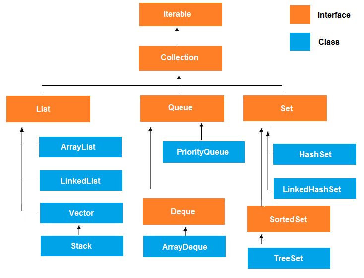
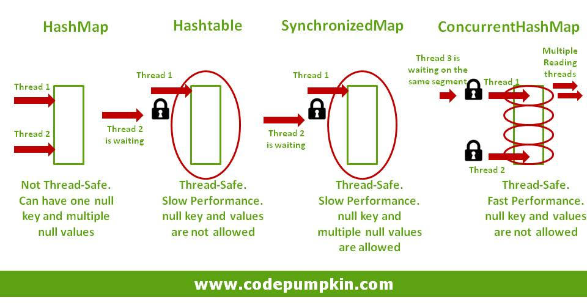
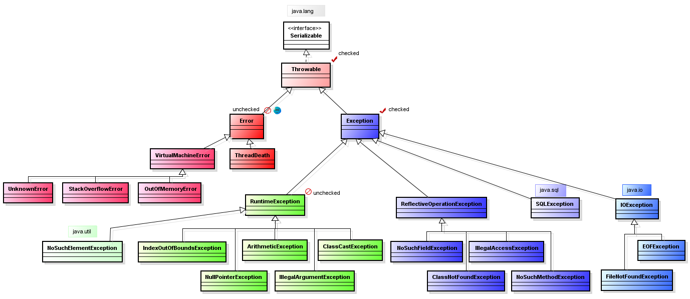

# Вопросы для интервью Java

## Базовый синтаксис:

1. Какие есть примитивные типы и какие у них размеры?
2. Почему 0.1 + 0.7 != 0.8? (float 0.9+0.7 считает с погрешностью, double почти все)
3. Что такое char? Почему над ним можно выполнять арифметические операции?
4. Какие есть виды приведения типов?
5. В каком случае компилятор не может сделать приведение сам и просит сделать приведение программиста?
6. Какие есть классы-обертки?
7. Зачем нужны классы-обертки? Immutable ли обертки?
8. Что такое unboxing(распаковка), autoboxing(автоупаковка) в обертках.
9. Если при распаковке обертка была равна `null`, произойдет исключение `java.lang.NullPointerException`?
10. Может ли примитив быть `null`? Что такое литерал?
11. Что такое `String Pool` (пул строк) и `Primitive Pool` (пул примитивов)?
12. Integer a = 100; Integer b = 100; System.out.println(b == a); Какой результат будет?
13. Почему не рекомендуются множественные конкатенации `String`?
14. Разница между `String`, `StringBuilder` (Java 1.5) и `StringBuffer`(Java 1.0)?
15. Что такое массив, какие на нём есть ограничения?
16. Существуют ли многомерные массивы в java? Как создать многомерный массив?
17. Что такое метод и чем отличается от функции, возвращаемое значение, аргументы метода?
18. Что такое инкремент и декремент?
19. Чем отличаются постфиксная и префиксная форма?
20. Какие есть логические операции?
21. А если подряд три true XOR true XOR true какой результат?
22. Расскажи про все условные операторы?
23. Можно ли в switch case использовать String, Enum?
24. Какие есть циклы в Java? Чем отличаются друг от друга? (пост условие пред условие)
25. Что такое continue и break? Почему не рекомендуется их использовать?
26. Если в case не поставить break что будет?
27. Что такое рекурсия? Недостатки и преимущества?
28. Зачем нужны BigInteger и BigDecimal?

## ООП

1. Что такое ООП? В чем его плюсы?
2. Перечислите основные принципы ООП (3 штуки) без объяснений?
3. Что такое инкапсуляция? Приведите пример инкапсуляции?
4. Что такое полиморфизм? Приведите пример полиморфизма?
5. Что такое наследование? Приведите пример наследования? Зачем оно нужно?
6. Что такое класс? Объект?
7. Передача параметров по ссылке или по значению?
8. Как передаются объекты в метод?
9. Что будет если передать массив в метод, который изменит его значения, изменятся ли они вне метода? Почему? А если
   передать примитив?
10. Что такое переопределение метода в Java?
11. Что такое перегрузка метода в Java?
12. Что такое нативные методы, их плюсы и минусы?
13. Перечислите все модификаторы доступа в порядке уменьшения закрытости, какую область видимости они имеют?
14. Что такое final?
15. Что может быть final? Как они работают?
16. Как реализована неизменность String?
17. Как реализовать свой Immutable тип данных?
18. Что такое ключевое слово static? Что может быть static? Можно ли использовать статические методы в обычных?
    Наоборот? Почему?
19. Может ли статический метод быть перегружен?
20. Будет ли работать переопределение статического метода?
21. Могут ли нестатические методы перегрузить статические?
22. Что такое пакет? Как создать пакет?
23. Что такое конструкторы? Конструктор по-умолчанию?
24. Будет ли в классе конструктор и какой, если при его создании ни один не был задан?
25. Будет ли создан автоматически конструктор по-умолчанию, если в созданном классе есть любой другой конструктор?
26. Можно ли в классе вызвать один конструктор из другого? Как это сделать?
27. Как вызвать конструктор родителя?
28. Расскажи, что такое this и super? Когда мы обязаны использовать this и super?
29. Класс Object, все методы кроме wait, notify, notifyAll, назвать и объяснить, как работают
30. Зачем нужен метод finalize?
31. Какой контракт между equals и hashcode? Из-за чего происходят коллизии?
32. Почему нельзя написать hashcode гарантировано без коллизий?
33. В чём разница между instanceOf и getClass?
34. Перечислите методы именно класса Enum?
35. Что такое интерфейс? Когда использовать интерфейс? Можно ли создать поля в интерфейсе?
36. Есть ли в Java множественное наследование классов?
37. Что дает множественная реализация интерфейсов?
38. Зачем наследовать интерфейс интерфейсу?
39. Можно ли создавать статик методы в интерфейсах?
40. Что такое абстрактный метод?
41. Что такое абстрактный класс? Чем отличается от обычного?
42. Может ли быть абстрактный класс без абстрактных методов?
43. Может ли быть конструктор у абстрактного класса? Для чего?
44. Синтаксические отличия интерфейса от абстрактного класса (АК)? 5 отличий

## Коллекции

1. Что такое коллекции (`Collection`) в Java? Какие основные интерфейсы коллекций вы знаете? Нарисуйте иерархию классов
   коллекций.
2. В чем разница между `List`, `Set` и `Map`?
3. Что такое `ArrayList`? В чем разница между `ArrayList` и `LinkedList`? Когда лучше использовать ArrayList, а когда
   LinkedList?
4. В чём разница между `Queue` и `Deque` и `Stack`?
5. Отличие двусвязного и односвязного списка?
6. В чём разница между `Iterable` и `Iterator`?
7. Что такое Iterator? В каких случаях нужно использовать iterator? И почему?
8. Что такое `HashMap`? Какие основные методы доступа и модификации данных в `HashMap`?
9. Может ли `null` быть ключом в `HashMap`?
10. Как работает `HashMap`?
11. Как работает метод put под капотом?
12. Что происходит при коллизии?
13. Что такое `HashSet`? Какая особенность у `HashSet` в отношении дубликатов и порядка элементов?
14. Какие коллекции из `Java Collections Framework` потокобезопасны (`thread-safe`) по умолчанию?
15. Что такое `ConcurrentHashMap`? В чем его отличие от `HashMap`?
16. Как можно сортировать элементы в коллекциях? Какой интерфейс следует использовать для сортировки?

## Исключения

1. Что такое исключение (`Exception`) в Java? Какие проблемы они помогают обрабатывать?
2. Расскажи (нарисуй) про иерархию исключений?
3. Как создать свое исключение? Зачем создавать свои?
4. В чём разница между проверяемыми (`checked`) исключениями и непроверяемыми (`unchecked`)?
5. В чём разница с точки зрения синтаксиса и идеологическая при использовании?
6. Можно ли обработать непроверяемое исключение?
7. Можно ли в сигнатуре метода в `throws` указать непроверяемое исключение?
8. Нужно ли ловить `Error` исключения?
9. Как бросить исключение?
10. Можно ли бросить НЕ новое исключение?
11. Назовите знакомые вам исключения и когда они могут возникнуть.
12. Можно ли так написать `try { throw new Object(); }`
13. Может ли `main` выбрасывать исключения, что будет происходить?
14. Расскажи про информацию, которая находится внутри исключения? Как с ней работать?
15. Что такое подавленные исключения?
16. Как достать подавленное исключение?
17. Какую информацию можно получить из `StackTraceElement`?
18. Расскажи про конструкцию `try-catch-finally`?
19. Когда будет выполнен `finally`? Когда не будет выполнен?
20. Будет ли выполнен `finally` при `Error`?
21. Что будет если до перехода в `finally` был вызван `return`?
22. Какой `return` выполнится – если их два, один в `try`, другой в `finally`?
23. Что если в конструкции `try finally` вылетело исключение сначала в `try` а потом в `finally`? Какое исключение
    вылетит? Что будет с другим?
24. Что такое `try-with-resources`? Как работает эта конструкция?
25. Что такое ресурс в конструкции `try-with-resources`?
26. Что будет если при закрытии ресурса вылетит исключение в конструкции `try-with-resources`?

## Threads

1. Что такое поток (`Thread`) в Java?
2. В чем отличие потока (`Thread`) от процесса (`Process`)?
3. Как создать новый поток?
4. Что значит и для чего используется ключевое слово `final`?
5. Что значит и для чего используется ключевое слово `volatile`? Как оно влияет на работу с переменными в многопоточной
   среде?
6. Что значит и для чего используется ключевое слово `synchronized`?
7. Что такое монитор?
8. Какие методы класса Object используются для синхронизации и ожидания потоков?
9. Что такое wait() и notify() методы? Как они используются для синхронизации потоков?
10. Что такое взаимная блокировка (deadlock)? Как она возникает и как ее избежать?
11. Что вы знаете о пакете `java.util.concurrent`?

## Ответы

### 1. Какие есть примитивные типы и какие у них размеры?

| Тип данных | Размер в байтах | Размер в битах | Диапазон значений                                          |
|------------|-----------------|----------------|------------------------------------------------------------|
| byte       | 1               | 8              | -128 до 127                                                |
| short      | 2               | 16             | -32,768 до 32,767                                          |
| int        | 4               | 32             | -2,147,483,648 до 2,147,483,647                            |
| long       | 8               | 64             | -9,223,372,036,854,775,808 до 9,223,372,036,854,775,807    |
| float      | 4               | 32             | Приблизительно ±3.40282347E+38 (6-7 значащих цифр)         |
| double     | 8               | 64             | Приблизительно ±1.7976931348623157E+308 (15 значащих цифр) |
| char       | 2               | 16             | 0 до 65,535 (включая полный набор Unicode символов)        |
| boolean    | 1               | 8              | true или false                                             |

### 2. Почему 0.1 + 0.7 != 0.8? (float 0.9+0.7 считает с погрешностью, double почти все)

Для хранения чисел с дробной частью в компьютерах
используется [Двоичная система с плавающей запятой](https://ru.wikipedia.org/wiki/%D0%A7%D0%B8%D1%81%D0%BB%D0%BE_%D1%81_%D0%BF%D0%BB%D0%B0%D0%B2%D0%B0%D1%8E%D1%89%D0%B5%D0%B9_%D0%B7%D0%B0%D0%BF%D1%8F%D1%82%D0%BE%D0%B9).
В Java для этого используются типы данных `float` и `double`, однако, из-за ограниченного количества бит для
представления чисел, некоторые дробные значения не могут быть точно представлены, что может приводить к неточным
результатам при арифметических операциях. Чтобы избежать проблем с точностью, рекомендуется
использовать класс `BigDecimal` или сравнивать числа с маленькой допустимой погрешностью вместо проверки на точное
равенство.

### 3. Что такое char? Почему над ним можно выполнять арифметические операции?

`char` - это примитивный числовой тип данных, который используется для представления одного
символа [Unicode](https://en.wikipedia.org/wiki/Unicode). По сути, каждый символ `Unicode` представляется числовым
значением, поэтому выполнять арифметические операции с `char` возможно.
Пример:

```java
class Example {
    public static void main(String[] args) {
        char ch1 = 'a'; // числовое значение 97
        char ch2 = 'b'; // числовое значение 98
        char result = (char) (ch1 + ch2); // числовое значение 97 + 98 = 195
    }
}
```

### 4. Какие есть виды приведения типов?

- Неявное (автоматическое) приведение типов. Происходит автоматически, когда значение одного типа данных присваивается
  переменной другого типа с большим диапазоном значений. Например, присваивание int (4 байта) переменной типа double (8
  байт).

```java
class Example {
    public static void main(String[] args) {
        // Пример 1
        int x = 10;
        double y = x; // Неявное приведение int к double

        // Пример 2 
        float a = 3.14f;
        double b = a; // Неявное приведение float к double
    }
}
```

- Явное (ручное) приведение типов: Происходит вручную, когда мы явно указываем, что хотим преобразовать
  из одного типа в другой. При явном приведение типов может происходить потеря данных.

```java
class Example {
    public static void main(String[] args) {
        // Пример 1
        double c = 7.65;
        int d = (int) c; // Явное приведение double к int, дробная часть будет отброшена


        // Пример 2
        int e = 130;
        byte f = (byte) e; // Явное приведение int к byte, возможна потеря данных из-за переполнения
    }
}
```

### 5. В каком случае компилятор не может сделать приведение сам и просит сделать приведение программиста?

Компилятор может выполнять неявное (автоматическое) приведение типов, когда оно безопасно и не приводит к потере данных.

- Преобразование из типа с большим диапазоном к типу с меньшим диапазоном. Например, преобразование `double` к `int`,
  что
  может привести к потере дробной части.
- Преобразование между различными типами данных, например, преобразование `float` к `int`.
- Передача аргументов методам с различными типами. Если типы аргументов метода не совпадают с типами параметров,
  требуется явное приведение.

### 6. Какие есть классы-обертки?

Для каждого примитивного типа данных в Java есть обертка, которая позволяют превратить его в объект

| Примитивный тип данных | Обертка   |
|------------------------|-----------|
| byte                   | Byte      |             
| short                  | Short     |             
| int                    | Integer   |             
| long                   | Long      |             
| float                  | Float     |             
| double                 | Double    |    
| char                   | Character |    
| boolean                | Boolean   |

### 7. Зачем нужны классы-обертки? Immutable ли обертки?

Обертки позволяют нам работать с примитивными типами данных как с объектами. Это особенно полезно, когда мы
работаем с классами из пакета `java.util.Collections`, которые могут хранить только объекты, а не примитивные типы.

Обертки являются неизменяемыми (immutable), так что каждый раз создается новый объект.

### 8. Что такое unboxing(распаковка), autoboxing(автоупаковка) в обертках.

Unboxing(распаковка) и autoboxing(автоупаковка) - это процессы автоматического преобразования между примитивными типами
и соответствующими обертками, благодаря которым мы можем бесшовно использоваться обертки и примитивы.

- Autoboxing (автоупаковка) - процесс автоматического преобразования из примитива в обертку.
- Unboxing (распаковка) - процесс автоматического преобразования обертки обратно в примитивный тип.

```java
class Example {
    public static void main(String[] args) {
        int a = 42;

        Integer wrappedA = a; // Автоупаковка, int преобразуется в Integer

        int b = wrappedA; // Распаковка, Integer преобразуется в int
    }
}
```

### 9. Если при распаковке обертка была равна `null`, произойдет исключение `java.lang.NullPointerException`?

Да, мы получим `NPE`, поскольку мы получим `null` при распаковке, а примитивные типы данных не могут быть равны `null`.

### 10. Может ли примитив быть `null`? Что такое литерал?

Примитивные типы данных не могут быть равны `null`.
Литералы - это **константные** значения, которые находятся в коде и не меняются во время работы программы.

### 11. Что такое `String Pool` (пул строк) и `Primitive Pool` (пул примитивов)?

Пул строк и пул примитивов - это механизм в Java используемый для оптимизации использования памяти и повышения
производительности, за счет использования уже существующих значений, вместо создания новых.

Пример для `String Pool`:

```java
class Example {
    public static void main(String[] args) {
        String str1 = "Hello"; // Строка добавляется в String Pool
        String str2 = "Hello"; // Используется уже существующая ссылка из String Pool
        String str3 = new String("Hello"); // Не добавляется в String Pool, создается новый объект

        System.out.println(str1 == str2); // true, так как используется ссылка из String Pool
        System.out.println(str1 == str3); // false, так как мы создали новый объект str3
    }
}
```

`Primitive Pool`:
Стоит отметить, что в Primitive Pool сохраняются не все примитивные типы.
`long`,`float`, `double` не сохраняются в Primitive Pool.

| Примитивный тип данных | Диапазон который сохраняется в Pool                        |
|------------------------|------------------------------------------------------------|
| byte                   | -128 до 127                                                |             
| short                  | -128 до 127                                                |             
| int                    | -128 до 127                                                |              
| char                   | '\u0000' (нулевой символ) до '\u007F' (символ с кодом 127) |    
| boolean                | true и false                                               |

### 12. Integer a = 100; Integer b = 100; System.out.println(b == a); Какой результат будет?

Результат будет `true`, поскольку 100 входит в диапазон значений для Primitive Pool.

```java
class Example {
    public static void main(String[] args) {
        Integer a = 100;
        Integer b = 100;
        System.out.println(a == b); // true

        Integer c = 1000;
        Integer d = 1000;
        System.out.println(c == d); // false
    }
}
```

### 13. Почему не рекомендуются множественные конкатенации `String`?

В Java String являются неизменяемыми объектами, что означает, что каждая операция сложения будет создавать новую строку.
Вместо простого сложения большого количества строк лучше иcпользовать `StringBuilder`.

```java
class Example {
    public static void main(String[] args) {
        StringBuilder sb = new StringBuilder();
        sb.append("Hello");
        sb.append(" ");
        sb.append("World");
        String result = sb.toString();
        System.out.println(result);
    }
}
```

### 14. Разница между `String`, `StringBuilder` (Java 1.5) и `StringBuffer`(Java 1.0)?

`String` - это неизменяемый класс, из-за чего при его изменении (конкатенация, создание подстроки итд) каждый раз
создается новая строка.

`StringBuilder` - это изменяемый класс, который позволяет изменять строку без создания новых строк. Так же предоставляет
методы для изменения, добавления и удаления символов или подстрок в строке, что делает его более эффективным при
множественных изменениях строки.

`StringBuffer` - это потоко-безопасный (thread-safe) аналог `StringBuilder`.

### 15. Что такое массив, какие на нём есть ограничения?

Массив - это структура данных, которая представляет собой упорядоченную коллекцию элементов одного типа. Элементы
массива расположены в памяти последовательно.

Ограничения массивов:

1. Фиксированный размер. Размер массива определяется в момент его создания и не может изменяться в дальнейшем
2. Один тип данных. Массив может содержать элементы только одного типа данных.
3. Индексация. Элементы массива нумеруются с нуля. Доступ к элементам осуществляется по их индексу, и выход за пределы
   массива может привести к ошибке `ArrayIndexOutOfBoundsException`.

### 16. Существуют ли многомерные массивы в java? Как создать многомерный массив?

Да, существуют. Многомерный массив - это собой массив массивов или, другими словами, это
массив, элементами которого также являются массивы. Наиболее распространенные многомерные массивы - это двумерные
массивы, но можно создавать массивы с большим числом измерений.

Пример создания многомерного массива:

```java
class Example {
    public static void main(String[] args) {
        // двумерный массив размером 3x4 (3 строки и 4 столбца).
        int[][] twoDimensionalArray = new int[3][4];

        // трехмерный массив размером 2x3x4 (2 блока, каждый из которых содержит 3 строки и 4 столбца).
        int[][][] threeDimensionalArray = new int[2][3][4];
    }
}
```

### 17. Что такое метод и чем отличается от функции, возвращаемое значение, аргументы метода?

Метод - это блок кода внутри класса, выполняющий определенную операцию или действие. Привязан к объектам класса.

Термин "функция" часто используется как синоним "метода", однако "функция" не привязана к объекту класса.

Возвращаемое значение - это значение, которое метод возвращает после выполнения операции.

Аргументы метода - это значения, переданные в метод при его вызове для использования внутри метода.

### 18. Что такое инкремент и декремент?

Инкремент и декремент - это унарные операции, которые увеличивают (инкремент) или уменьшают (декремент) значение
переменной на единицу.

```java
class Example {
    public static void main(String[] args) {

        // Инкремент
        int x = 5;
        x++; // Теперь x равно 6

        // Декремент
        int y = 10;
        y--; // Теперь y равно 9

    }
}
```

### 19. Чем отличаются постфиксная и префиксная форма?

Постфиксная и префиксная формы отличаются порядком выполнения операций, что произойдет раньше изменение значения или его
возврат.

- Постфиксная форма
    - Возврат значения переменной
    - Изменение значения переменной
- префиксная форма
    - Изменение значения переменной
    - Возврат значения переменной

```java
class Example {
    public static void main(String[] args) {

        // Постфиксная форма
        int x = 5;
        // Сначала мы присвоим значение x равное 5 в переменную resultX, а уже после мы увеличим его на 1
        // Результат: x=6 resultX=5
        int resultX = x++;


        // Префиксная форма
        int y = 10;
        // Сначала мы увеличим значение на 1 и получим y=11, а уже после мы присвоим значение y равное 11 в переменную resultY
        // Результат: y=11 resultY=11
        int resultY = ++y;
    }
}
```

### 20. Какие есть логические операции?

1. Логическое И (AND) записывается как (&&). Принимает значение `true` только если оба параметра являются
   истинными `true`. Таблица истинности:

| A     | B     | A && B |
|-------|-------|--------|
| true  | true  | true   |
| true  | false | false  |
| false | true  | false  |
| false | false | false  |

2. Логическое ИЛИ (OR) записывается как (||). Принимает значение `true` сли хотя бы один из параметров является
   истинным `true`. Таблица истинности:

| A     | B     | A \|\| B |
|-------|-------|----------|
| true  | true  | true     |
| true  | false | true     |
| false | true  | true     |
| false | false | false    |

3. Логическое НЕ (NOT) записывается как (!). Изменяет значение параметра на противоположное
   Таблица истинности:

| A     | !A    |
|-------|-------|
| true  | false |
| false | true  |

4. Исключающее ИЛИ (XOR) записывается как (^). Принимает значение `true` только если один параметр является
   истинным `true`. Таблица истинности:

| A     | B     | A ^ B |
|-------|-------|-------|
| true  | true  | false |
| true  | false | true  |
| false | true  | true  |
| false | false | false |

Вы можете скопировать и вставить этот код в свой файл формата Markdown для отображения таблицы истинности логических
операций.

### 21. А если подряд три true XOR true XOR true какой результат?

Результат будет true, поскольку `true XOR true = false`, а `false XOR true = true`.

```java
class Example {
    public static void main(String[] args) {
        boolean result = true ^ true ^ true;

        System.out.println("Результат выражения: " + result);
    }
}
```

### 22. Расскажи про все условные операторы?

В Java существуют три условных оператора `if`, `switch` и Тернарный оператор `?`.

1. Оператор `if` выполняет код если условие истинное, если же оно ложное, то выполняется код в блоке `else`, однако его
   может и не быть.
   Пример:

```java
class Example {
    public static void main(String[] args) {
        int x = 10;

        // If без else
        if (x > 0) {
            System.out.println("Число положительное");
        }

        // if-else
        if (x > 0) {
            System.out.println("Число положительное");
        } else {
            System.out.println("Число не положительное");
        }

        // несколько if-else
        if (x > 0) {
            System.out.println("Число положительное");
        } else if (x < 0) {
            System.out.println("Число отрицательное");
        } else {
            System.out.println("Число равно нулю");
        }
    }
}
```

2. Оператор `switch` может иметь несколько блоков кода, каждый из которых выполниться при определенном условии.

```java
class Example {
    public static void main(String[] args) {
        int dayOfWeek = 3;
        switch (dayOfWeek) {
            case 1:
                System.out.println("Понедельник");
                break;
            case 2:
                System.out.println("Вторник");
                break;
            case 3:
                System.out.println("Среда");
                break;
            default:
                System.out.println("День недели неизвестен");
        }

    }
}
```

3. Тернарный оператор `?` является упрощенной формой записи оператора `if-else`.
   Форма записи тернарного оператора: `условие ? значение_если_истина : значение_если_ложь`

```java
class Example {
    public static void main(String[] args) {
        int a = 10;
        int b = 5;
        int max = (a > b) ? a : b;
        System.out.println("Максимальное значение: " + max);
    }
}
```

### 23. Можно ли в switch case использовать String, Enum?

Да, в switch case можно использовать строки и перечисления.

Пример со строкой:

```java
class Example {
    public static void main(String[] args) {
        String dayOfWeek = "Monday";
        switch (dayOfWeek) {
            case "Monday":
                System.out.println("Понедельник");
                break;
            case "Tuesday":
                System.out.println("Вторник");
                break;
            // ... другие варианты дней недели ...
            default:
                System.out.println("День недели неизвестен");
        }

    }
}
```

Пример с перечислением:

```java
class Example {
    public static void main(String[] args) {
        enum Color {
            RED, GREEN, BLUE;
        }

        Color color = Color.RED;
        switch (color) {
            case RED:
                System.out.println("Красный");
                break;
            case GREEN:
                System.out.println("Зеленый");
                break;
            case BLUE:
                System.out.println("Синий");
                break;
            default:
                System.out.println("Цвет неизвестен");
        }
    }
}
```

### 24. Какие есть циклы в Java? Чем отличаются друг от друга? (пост условие пред условие)

1. Цикл `for` используется для выполнения блока кода заданное количество раз.
   Синтаксис:

```java
for(инициализация;условие;операци после итерации){
        // Блок кода, который будет выполняться
        }
```

2. Цикл `while`, используется для выполнения блока кода, пока заданное условие истинно.
   Синтаксис:

```java
while(условие){
        // Блок кода, который будет выполняться
        }
```

3. Цикл `do-while` похож на цикл "while", но проверка условия происходит после каждой итерации, поэтому блок кода
   выполняется хотя бы один раз, даже если условие изначально ложно.
   Синтаксис:

```java
do{
        // Блок кода, который будет выполняться
        }while(условие);
```

### 25. Что такое continue и break? Почему не рекомендуется их использовать?

`continue` и `break` - это управляющие операторы.
Рекомендация: в некоторых случаях `continue` и `break` могут использоваться, однако нужно стараться избегать частого
их использования, поскольку они усложняют логику и затрудняют понимание кода.

1. `Continue` - используется в циклов (`for`, `while`, `do-while`), чтобы перейти к следующей итерации.

```java
class Example {
    public static void main(String[] args) {
        for (int i = 1; i <= 5; i++) {
            if (i == 3) {
                continue; // Пропустить i = 3 и перейти к следующей итерации
            }
            System.out.println(i);
        }
        // Результат в консоли: 1, 2, 4, 5
    }
}
```

2. `Break` - используется в циклах и в `switch` для того, чтобы преждевременно выйти из него.

```java
class Example {
    public static void main(String[] args) {
        for (int i = 1; i <= 5; i++) {
            if (i == 3) {
                break; // Завершить цикл, если i = 3
            }
            System.out.println(i);
        }
        // Результат в консоли: 1, 2
    }
}
```

### 26. Если в case не поставить break что будет?

Если не добавить `break` в конце `case`, то произойдет так называемое "проваливание (fall-through)" и начнет выполняться
следующий блок `case`.

```java
class Example {
    public static void main(String[] args) {
        int dayOfWeek = 3;
        switch (dayOfWeek) {
            case 1:
                System.out.println("Понедельник");
            case 2:
                System.out.println("Вторник");
            case 3:
                System.out.println("Среда");
            case 4:
                System.out.println("Четверг");
            case 5:
                System.out.println("Пятница");
            default:
                System.out.println("Выходные");

                // Результат в консоли:
                // Среда
                // Четверг
                // Пятница
                // Выходные
        }
    }
}
```

### 27. Что такое рекурсия? Недостатки и преимущества?

Рекурсия - это техника в программировании, при которой функция вызывает саму себя. Это позволяет решать сложные задачи
шаг за шагом.
Хорошим примером рекурсии является решение задачи по вычислению факториала числа.

```java
class Example {
    public static void main(String[] args) {
        System.out.println(factorial(10)); // Результат: 3628800
    }

    static int factorial(int n) {
        if (n == 0 || n == 1) {
            return 1;
        } else {
            return n * factorial(n - 1);
        }
    }

}
```

Преимущества:

1. Позволяет решать сложные задачи постепенно через разбиение на простые подзадачи.
2. Удобство решения. Решение некоторых задач очень удобно можно представить в рекурсивной форме, к примеру обход
   деревьев или графов.
3. В некоторых ситуациях, рекурсия может быть более эффективной чем итеративные подходы.

Недостатки

1. Потенциальная переполнение стека. Каждый рекурсивный вызов добавляется в стек, так как что если рекурсия слишком
   глубокая, то может произойти переполнение стека с ошибкой `StackOverflowError`.
2. Рекурсия может проигрывать итеративным подходам за счет дополнительных расходов на управление стеком вызовов.
3. Рекурсивные функции сложны для отладки, из-за того, что мы постоянно делаем вложенные вызовы.

### 28. Зачем нужны BigInteger и BigDecimal?

`BigInteger` и `BigDecimal` нужны для того, чтобы работать с числами, которые не помещаются в примитивные типы данных.
`BigInteger` позволяет работать с целыми числами произвольной длины числами
`BigDecimal`позволяет работать с плавающей запятой произвольной точности.

## OOП

### 1. Что такое ООП? В чем его плюсы?

ООП (Объектно-Ориентированное Программирование) - это подход в программировании при котором программа представляется в
виде набора объектов. Объекты состоят из данных (поля объекта) и операции (методы в объекта) для работы с этими данными.
В ООП основное внимание уделяется объектам и их взаимодействию, а не просто последовательности функций, как
в процедурном программировании.

#### Плюсы

- Модульность и структурирование. ООП позволяет разбивать программы на небольшие, независимые классы, что упрощает
  разработку, понимание и тестирование кода.
- Повторное использование кода. Благодаря наследованию и полиморфизму мы можем повторно использовать код, что
  способствует уменьшению дублирования и обеспечивает экономию времени при разработке.
- Гибкость и расширяемость. ООП позволяет легко добавлять новые функции или изменять существующую логику без
  необходимости переписывания всего кода.
- Улучшенное управление сложность. ООП позволяет управлять сложностью программы, разделяя ее на меньшие, легко
  управляемые части.

### 2. Перечислите основные принципы ООП (3 принципа без объяснений)?

1. Инкапсуляция - сокрытие реализации.
2. Наследование - создание новой сущности на базе уже существующей.
3. Полиморфизм - возможность иметь разные формы для одной и той же сущности.

### 3. Что такое инкапсуляция?

Инкапсуляция - это принцип ООП, который говорит о том, что нужно скрывать внутренние свойства объекта такие, как данные
или методы от внешнего доступа и предоставлять доступ только к тому, что необходимо при последующем использовании.

```java
public class BankAccount {
    private String accountNumber;
    private double balance;

    public BankAccount(String accountNumber, double initialBalance) {
        this.accountNumber = accountNumber;
        this.balance = initialBalance;
    }

    public void deposit(double amount) {
        if (amount > 0) {
            balance += amount;
        }
    }

    public void withdraw(double amount) {
        if (amount > 0 && amount <= balance) {
            balance -= amount;
        }
    }

    public double getBalance() {
        return balance;
    }
}
```

В этом примере класс `BankAccount` инкапсулирует свои поля `accountNumber` и `balance`, чтобы предотвратить прямой
доступ извне. За изменение баланса отвечают методы `deposit` и `withdraw`, которые проверяют, что сумма для депозита или
снятия положительная и не превышает текущий баланс. Доступ к балансу осуществляется через метод `getBalance`, который
возвращает текущий баланс без возможности изменения его значения напрямую извне.

### 4. Что такое полиморфизм?

Полиморфизм - это принцип ООП, который позволяет объектам разных классов обладать одинаковым интерфейсом и проявлять
разное поведение в зависимости от своего конкретного типа. В контексте полиморфизма, один интерфейс может иметь
несколько различных реализаций.

Давайте рассмотрим более реалистичный пример полиморфизма на примере классов `Shape` и его наследников `Circle`
и `Rectangle`. У каждой фигуры есть метод `calculateArea()`, который будет проявлять разное поведение в зависимости от
типа фигуры.

```java
interface Shape {
    String shapeName();

    double calculateArea();
}

class Circle extends Shape {
    private double radius;

    public Circle(double radius) {
        this.radius = radius;
    }

    @Override
    public String shapeName() {
        return "Circle";
    }

    @Override
    public double calculateArea() {
        return Math.PI * radius * radius;
    }
}

class Rectangle extends Shape {
    private double width;
    private double height;

    public Rectangle(double width, double height) {
        this.width = width;
        this.height = height;
    }

    @Override
    public String shapeName() {
        return "Rectangle";
    }

    @Override
    public double calculateArea() {
        return width * height;
    }
}
```

Теперь создадим массив объектов типа `Shape`, и добавим в него экземпляры классов `Circle` и `Rectangle`. В результате,
когда вызываем метод `calculateArea()` для каждого элемента массива, он будет проявлять разное поведение в зависимости
от типа фигуры.

```java
public class Example {
    public static void main(String[] args) {
        Shape[] shapes = new Shape[2];
        shapes[0] = new Circle(5.0);
        shapes[1] = new Rectangle(4.0, 6.0);

        for (Shape shape : shapes) {
            System.out.println(shape.shapeName() + " area = " + shape.calculateArea());
        }
    }
}
```

Результат:
Circle area: 78.53981633974483
Rectangle area: 24.0

Здесь полиморфизм проявляется в том, что объекты классов `Circle` и `Rectangle` определенны как интерфейс `Shape`, и
метод `calculateArea()` вызывает разные реализации в зависимости от типа фигуры. Это позволяет общему интерфейсу `Shape`
проявлять разное поведение для различных подтипов, что является примером полиморфизма в ООП.

### 5. Что такое наследование?

Наследование - это принцип ООП, который позволяет создавать новый класс (подкласс или класс-наследник) на основе уже
существующего класса (суперкласс или базовый класс). Подкласс наследует свойства и методы суперкласса и может добавлять
свои собственные свойства и методы.

Основные принципы наследования:

- Переиспользование кода. Наследование позволяет повторно использовать код, который уже был написан в суперклассе, без
  необходимости повторно его реализовывать в каждом подклассе.
- Расширяемость и гибкость. Подклассы могут добавлять новые свойства и методы, что позволяет расширять функциональность
  существующих классов и создавать новые классы на основе уже существующих.
- Иерархия классов. Наследование позволяет создавать иерархию классов, где подклассы могут наследовать свойства и методы
  от своих суперклассов, образуя древовидную структуру классов.

В этом примере классы `Dog` и `Cat` являются подклассами класса `Animal`, таким образом, они наследуют его свойства и
методы, в данном случае, свойство `name` и метод `eat()`. Подклассы также могут добавлять свои собственные методы, такие
как `bark()`в классе `Dog` и `meow()` в классе `Cat`. Это позволяет создавать специализированные классы на основе общего
функционала

```java
class Animal {
    String name;

    public void eat() {
        System.out.println(name + " is eating.");
    }
}

class Dog extends Animal {
    public void bark() {
        System.out.println(name + " is barking.");
    }
}

class Cat extends Animal {
    public void meow() {
        System.out.println(name + " is meowing.");
    }
}
```

### 6. Что такое класс? Объект?

Класс это шаблон, который описывает состояние (поля) и поведение (методы). Его можно рассматривать как абстракцию,
которая представляет некоторый тип объектов и определяет их общие свойства и действия.

Пример класса `Person`, который описывает человека и имеет два поля (`name` и `age`) и метод `sayHello()` для
приветствия.

```java
public class Person {
    private final String name;
    private final int age;

    Person(String name, int age) {
        this.name = name;
        this.age = age;
    }

    public void sayHello() {
        System.out.println("Hello, my name is " + name + " and I am " + age + " years old.");
    }
}
```

Объект - это экземпляр класса, который имеет уникальные значения своих полей и может выполнять определенные действия,
определенные методами класса.

В приведенном ниже примере мы создаем два объекта, каждый из которых будет иметь свои уникальные значения полей.

```java
public class Example {
    public static void main(String[] args) {
        // Создание объекты класса Person
        Person person1 = new Person("John", 30);
        Person person2 = new Person("Kate", 25);

        // Вызов метода sayHello() для объекта person1 и person2
        person1.sayHello();
        person2.sayHello();
    }
}
```

### 7. Передача параметров по ссылке или по значению?

В Java значения могут передаваться как по ссылке, так и по значению. Для понимания разницы между передачей по значению и
по ссылке, важно различать примитивные типы данных (int, double, boolean, и т.д.) и ссылочные типы данных (классы и
объекты).

- Передача параметров примитивных типов данных происходит **по значению**.

```java
public class Example {
    public static void main(String[] args) {
        int x = 10;
        modifyValue(x);
        System.out.println(x); // Выведет: 10 (значение переменной x не изменится)
    }

    public static void modifyValue(int value) {
        value = 20; // Изменяем копию значения, но не влияем на исходную переменную
    }
}
```

- Передача параметров ссылочных типов данных происходит **по ссылке**:

```java
public class Example {
    public static void main(String[] args) {
        StringBuilder sb = new StringBuilder("Hello");
        modifyStringBuilder(sb);
        System.out.println(sb); // Выведет: Hello World (значение объекта изменится)
    }

    public static void modifyStringBuilder(StringBuilder builder) {
        builder.append(" World"); // Модифицируем объект, на который ссылается builder
    }
}
```

### 9. Что будет если передать массив в метод, который изменит его значения, изменятся ли они вне метода? Почему? А если передать примитив?

Массивы являются ссылочными типами данных, следовательно, если передать массив в метод и внутри метода изменить что-то в
нем, то мы увидим эти изменения вне метода тоже.

```java
public class Example {
    public static void main(String[] args) {
        int[] array = {1, 2, 3};
        modifyArray(array);
        System.out.println(Arrays.toString(array)); // Выведет: [10, 20, 30]
    }

    public static void modifyArray(int[] arr) {
        for (int i = 0; i < arr.length; i++) {
            arr[i] *= 10;
        }
    }
}
```

### 10. Что такое переопределение метода в Java?

Переопределение метода (Method Overriding) - это механизм ООП, когда подкласс (наследник) предоставляет свою
собственную реализацию метода, который уже определен в его суперклассе (базовом классе). При переопределении метода,
сигнатура (имя, параметры) метода в подклассе должна точно совпадать с сигнатурой метода в суперклассе.

Когда объект подкласса вызывает переопределенный метод, будет использоваться реализация метода из подкласса, а не из
суперкласса. Это позволяет объектам различных типов проявлять разное поведение для одноименных методов, что является
примером полиморфизма в ООП.

Условия для переопределения метода:

1. Название метода, параметры и возвращаемый тип в подклассе должны точно совпадать с сигнатурой метода в суперклассе.
2. Модификатор доступа метода в подклассе не может быть менее доступным, чем в суперклассе (например, если метод в
   суперклассе имеет модификатор `protected`, то в подклассе он также должен иметь `protected` или более доступный
   модификатор, такой как `public`).
3. Возвращаемый тип метода в подклассе может быть подтипом возвращаемого типа в суперклассе (ковариантное возвращаемое
   значение).

Пример:
Класс `Dog` наследует от класса `Animal` и переопределяет его метод `makeSound()`. Когда объект
типа `Dog` вызывает метод `makeSound()`, будет использоваться переопределенная реализация из класса `Dog`, что позволяет
собаке произносить звук "Woof woof!" вместо общего звука, определенного в суперклассе `Animal`.

```java
class Animal {
    public void makeSound() {
        System.out.println("Some generic animal sound");
    }
}

class Dog extends Animal {
    @Override
    public void makeSound() {
        System.out.println("Woof woof!");
    }
}
```

### 11. Что такое перегрузка метода в Java?

Перегрузка метода - это механизм ООП, который позволяет создать в одном классе несколько методов с одним и тем же
именем, методы будут отличаться только количеством или типом параметров. Когда вызывается перегруженный метод, Java
определяет, какой из перегруженных методов будет вызываться, основываясь на переданных аргументах вызова метода.

Пример:

```java
public class Calculator {
    public int add(int a, int b) {
        return a + b;
    }

    public double add(double a, double b) {
        return a + b;
    }

    public int add(int a, int b, int c) {
        return a + b + c;
    }
}
```

Вызов:

```java
public class Example {
    public static void main(String[] args) {
        Calculator calculator = new Calculator();
        int result1 = calculator.add(3, 5); // Вызов первого метода add(int, int)
        double result2 = calculator.add(2.5, 4.7); // Вызов второго метода add(double, double)
        int result3 = calculator.add(1, 2, 3); // Вызов третьего метода add(int, int, int)
    }
}
```

### 12. Что такое нативные методы, их плюсы и минусы?

Нативные методы - это методы, которые реализованы на другом языке (к примеру C, C++ итд). В большинстве случаев, эти
методы используются для выполнения задач, которые могут быть реализованы более эффективно. Например, для работы с
низкоуровневыми операциями системы, библиотеками операционной системы или оборудования.

- Плюсы
    - Могут улучшить производительность.
    - Можно получить доступ к низкоуровневым функциями, которых нет в Java.
- Минусы
    - Нужно поддерживать код на другом языке.
    - Могут возникнуть проблемы с переносимостью кода на различне платформы.
    - Могут быть не безопасными, так как нарушают изоляцию Java.

### 13. Перечислите все модификаторы доступа в порядке уменьшения закрытости, какую область видимости они имеют?

| Модификатор доступа | Область видимости                        |
|---------------------|------------------------------------------|
| private             | Доступен только в пределах класса        |
| (default)           | Доступен в пределах пакета               |
| protected           | Доступен в пределах пакета и наследникам |
| public              | Доступен отовсюду                        |

### 14. Что такое final?

`final` - это ключевое слово, которое используется для обозначения неизменяемых сущностей - констант, переменных,
методов и классов.
Значение или поведение сущностей, помеченных как final, не может быть изменено или переопределено после инициализации.

### 15. Что может быть final? Как они работают?

1. `Переменная`. Когда переменная помечена как `final`, ее значение не может быть изменено после
   первоначальной инициализации.
2. `Метод`. Когда метод объявлен как `final`, он не может быть переопределен(Override).
3. `Класс`. Когда класс объявлен как `final`, он не может быть наследован, т.e. нельзя создать подклассы этого класса.

### 16. Как реализована неизменность String?

Класс `java.lang.String` объявлен как финальный и он сохраняет значения в финальную
переменную `private final byte[] value;`, т.е. мы не может изменить ее значение после инициализации.

### 17. Как реализовать свой Immutable тип данных?

1. Создаем финальный класс, чтобы защититься от изменений в подклассах.
2. Помечаем все поля как финальные, чтобы обеспечить их неизменяемость после инициализации.
3. Предоставляем только методы на чтение (`getters`)
4. Убедиться, что все методы возвращают только копии данных, а не ссылки на оригинальные объекты, чтобы сохранить
   неизменяемость.

```java
public final class User {
    private final String name;
    private final int age;

    public ImmutablePerson(String name, int age) {
        this.name = name;
        this.age = age;
    }

    public String getName() {
        return name;
    }

    public int getAge() {
        return age;
    }
}
```

### 18. Что такое ключевое слово static? Что может быть static? Можно ли использовать статические методы в обычных? Наоборот? Почему?

`static` - это ключевое слово, которое используется для создания "статических" элементов класса. Статические элементы
принадлежат самому классу, а не его экземплярам (объектам), разделяются между всеми экземплярами класса и могут быть
использованы без необходимости создания объекта.

Мы можем использовать ключевое слово `static` для полей, методов, а также статических блоков инициализации.

#### Можно ли использовать статические методы в обычных?

Обычные методы (не помеченные как `static`) могут без проблем использовать статические поля и методы. С другой стороны
статические методы не могут напрямую использовать обычные методы. Это связано с тем, что статические методы существуют
независимо от созданных объектов, и они не имеют доступа к нестатическим данным объекта.

Пример:
Давайте разбрем как это работает на примере. Ниже вы видите реализацию класса `Person`, и у каждого человека есть имя
(переменная `name`), так же вы люди умеют здороваться (метода `sayHello()`) и могут сказать как их зовут
(метод `sayName()`).

```java
class Person {
    private final String name;

    Person(String name) {
        this.name = name;
    }

    public static void sayHello() {
        System.out.println("Hello!");
    }

    public void sayName() {
        System.out.println("My name is " + name);
    }
}
```

Любой человек умеет здороваться вне зависимости от того кто это конкретно, ваш друг или незнакомец. Однако, для того
чтобы представиться должен быть какой-то конкретный человек, который скажет вам свое имя.

```java
class Example {
    public static void main(String[] args) {
        Person.sayHello();

        Person ivan = new Person("Ivan");
        ivan.sayName();
    }
}
```

### 19. Может ли статический метод быть перегружен?

Да, статический метод может быть перегружен, так же как и обычные методы.

```java
public class MathUtils {
    public static int add(int a, int b) {
        return a + b;
    }

    public static double add(double a, double b) {
        return a + b;
    }

    public static int add(int a, int b, int c) {
        return a + b + c;
    }
}
```

### 20. Будет ли работать переопределение статического метода?

Нет, переопределение (override) статического метода не поддерживается. Поскольку статические методы принадлежат
самому классу, а не его экземплярам (объектам), то они не наследуются и не переопределяются в подклассах.

Когда подкласс объявляет метод с тем же именем и параметрами, что и статический метод в суперклассе, это не является
переопределением, а называется методом с тем же именем (method with the same name). При вызове статического метода,
используется версия метода из класса, где этот метод определен, а не из подкласса.

Пример:

```java
class Parent {
    public static void staticMethod() {
        System.out.println("Статический метод в суперклассе.");
    }
}

class Child extends Parent {
    // Это не является переопределением статического метода,
    // это метод с тем же именем, но в другом классе.
    public static void staticMethod() {
        System.out.println("Статический метод в подклассе.");
    }
}

public class Main {
    public static void main(String[] args) {
        Parent.staticMethod(); // Выведет: "Статический метод в суперклассе."
        Child.staticMethod();  // Выведет: "Статический метод в подклассе."
    }
}
```

ВАЖНО: Статический метод принадлежит классу! Обратите внимание на то, как работает код ниже.
В переменной `child` лежит объект класса `Child`, однако при вызове `staticMethod()` в консоли мы увидим результат из
класса `Parent`. Это происходит из-за того что мы сохраняем объект в переменную класса `Parent`, а статический метод как
мы помним принадлежит классу, а не объекту.

```java
public class Example {
    public static void main(String[] args) {
        Parent.staticMethod(); // Выведет: "Статический метод в суперклассе."
        Child.staticMethod();  // Выведет: "Статический метод в подклассе."

        Parent child = new Child();
        // Внимание!
        child.staticMethod(); // // Выведет: "Статический метод в суперклассе."
    }
}
```

### 21. Могут ли нестатические методы перегрузить статические?

Да, обычные методы могут перегрузить статические методы.

```java
public class MathUtils {
    public static int add(int a, int b) {
        return a + b;
    }

    public int add(int a, int b, int c) {
        return a + b + c;
    }
}
```

### 22. Что такое пакет? Как создать пакет?

Пакет (package) - это способ организации классов, который помогает логически группировать связанные классы вместе и
предотвратить конфликты имен.

Для того чтобы создать пакет, вам нужно создать иерархию каталогов (пример `com.example.myapp`), и в каталоге `myapp`
создать класс (пример `MyClass.class`) и в классе указать каталог `package com.example.myapp;`

Иерархия:

```
com/
    example/
        myapp/
            MyClass.java
```

Класс:

```java
package com.example.myapp;

public class MyClass {
    // Код класса
}
```

### 23. Что такое конструкторы? Конструктор по-умолчанию?

Конструктор - это специальный метода, который вызывается при создании объекта данного класса. Они используются для
начальной инициализации объекта.

Пример конструктора:

```java
public class Person {
    private final String name;
    private final int age;

    // Конструктор класса Person
    public Person(String name, int age) {
        this.name = name;
        this.age = age;
    }

    // Другие методы класса
}
```

Если в классе **не определен ни один конструктор**, то компилятор сам создаст дефолтный конструктор (конструктор
по-умолчанию). Этот конструктор не имеет параметров и инициализирует все поля дефолтными
значениями (`int=0`, `boolean=false`, `object=null` итд). Стоит отдельно отметить,

Пример класса с конструктором по умолчанию:

```java
public class Person {
    private String name;
    private int age;

    // Другие методы класса
}
```

### 24. Будет ли в классе конструктор и какой, если при его создании ни один не был задан?

Да, компилятор создаст дефолтный конструктор без параметров (См вопрос выше).

### 25. Будет ли создан автоматически конструктор по-умолчанию, если в созданном классе есть любой другой конструктор?

Нет, дефолтный конструктор создается только если в классе вообще нет ни одного конструктора.

### 26. Можно ли в классе вызвать один конструктор из другого? Как это сделать?

Да, мы можем вызвать один конструктор из другого с помощью ключевого слова `this`. Такие вызовы называются "цепочкой
конструкторов" и позволяют переиспользовать уже написанный код, а так же использовать значения по-умолчанию для каких-то
полей.

Пример:
Давайте представим, что мы хотим описать студента и мы знаем, что у нас в университете 80% студентов мужского пола, а
так же мы из создаем только в момент поступления, те 95% из них по 18 лет.

```java
public class Student {
    private String name;
    private int age;
    private String gender;

    // Конструктор 1
    public Student(String name, int age, String gender) {
        this.name = name;
        this.age = age;
        this.gender = gender;
    }

    // Конструктор 2
    public Student(String name, int age) {
        this(name, age, "Man");
    }

    // Конструктор 3
    public Student(String name) {
        this(name, 18);
    }

    // Другие методы класса
}
```

Тогда мы можем определить класс студента как показано ниже. У нас есть конструктор 1 со всеми параметрами, так же есть
конструктор в которой можно передать только `name` и `age` (к примеру если студенту 17 лет). А так же есть
конструктор номер 3 в котором передается только `name`, и тогда мы создадим студента мужского поля в возрасте 18 лет.

```java
public class Example {
    public static void main(String[] args) {
        Student student1 = new Student("Anna", 17, "Woman");
        Student student2 = new Student("Ivan", 19);
        Student student3 = new Student("Nick");
    }
}
```

### 27. Как вызвать конструктор родителя?

Чтобы вызвать конструктор родителя из подкласса мы должны использовать ключевое слово `super`. Вызов происходит
аналогично тому как мы вызываем другой конструктор, те `super(аргументы)`.

```java
class Parent {
    private int parentValue;

    public Parent(int parentValue) {
        this.parentValue = parentValue;
    }
}

class Child extends Parent {
    private int childValue;

    public Child(int parentValue, int childValue) {
        super(parentValue); // Вызываем конструктор родителя с параметром parentValue
        this.childValue = childValue;
    }
}

```

### 28. Расскажи, что такое this и super? Когда мы обязаны использовать this и super?

`this` - это ключевое слово, которое указывает на текущий объект. Используется, чтобы вызывать дургие конструкторы или
же различать локальные переменные и поля класса.

```java
public class Student {
    private int name;

    public Student(int name) {
        this.name = name; // Используем this для ссылки на поле класса name и установки значения из аргумента
    }

    public void sayName() {
        System.out.println("My name is " + this.name); // Используем this для доступа к полю name
    }

    public void anotherMethod() {
        sayName(); // Вызываем метод sayName() с использованием this
        this.sayName(); // аналогичная запись, но мы так не пишет так как слишком долго xD
    }
}


```

`super` - это ключевое слово, которое указывает на родительский класс (суперкласс). Используется, чтобы получить доступ
к полям, методам или конструктору родительского класса.

```java
public class Person {
    protected String name; // использует protected, чтобы наследники могли использовать это поле

    public Person(String name) {
        this.name = name; // Используем this для ссылки на поле класса name и установки значения из аргумента
    }
}

public class Student extends Person {
    private int[] marks;

    public Student(String name, int[] marks) {
        super(name); // Вызываем конструктор родителя с помощью super
        this.marks = marks;
    }

    public void sayName() {
        System.out.println("My name is " + super.name); // Используем super для доступа к полю name в родительском классе
    }

    public void sayMarks() {
        System.out.println("My marks are " + marks);
        System.out.println("My marks are " + this.marks); // Аналогичная запись, но длинная, так что `this.` опускается
    }
}
```

### 29. Класс `Object`, все методы кроме `wait`, `notify`, `notifyAll`, назвать и объяснить, как работают.

Кроме этих методов есть так же `getClass()`, `toString()`,`equals(Object anotherObject)`,`hashCode()`, `finalize`
и `clone`.

1. `getClass` возвращает объект класса `java.lang.Class`, который содержит мета-информацию о классе (можно получить имя
   класса, какие есть поля в классе и их типы итд).
2. `toString` возвращает строковое представление объекта. По-умолчанию возвращает строку в
   виде `имя класса@хеш-кода объекта` (пример `MyClass@32e6e9c3`). Практически всегда этот метод переопределяют, чтобы
   возвращать информацию в читаемом виде.
3. `equals(Object anotherObject)` - метод который сравнивает текущий объект (`this`) с объектом переданным в качестве
   параметра (`anotherObject`). По-умолчанию сравнивает ссылки на объекты, но часто его переопределяют.
4. `hashCode()` возвращает `хэш-код` объекта. Хэш-код - это просто целое число, которое обычно вычисляется на основе
   данных объекта. Главное условие, что оно должно быть одинаковым для двух объектов которые равны с помощью
   метода `equals`.
5. `finalize()` - метода который вызывает сборщик мусора перед удалением объекта. Обычно в этом методе освобождаются
   ресурсы перед удалением.
6. `clone()` создает копию текущего объекта. Есть разные "типы" копирования, поверхностным (shallow) или глубоким (
   deep).

### 30. Зачем нужен метод finalize?

`finalize()` - метода который вызывает сборщик мусора перед удалением объекта. Обычно в этом методе освобождаются
ресурсы перед удалением.

FYI: Начиная с Java 9 метод считается устаревшим и отмечен как `@Deprecated`.

Причины по которым его не рекомендуют использовать. Поскольку метод в основном освобождает ресурсы, то этот процесс
может занять слишком много времени, а так же нет гарантий когда сборщик мусора его вызовет, а главное вызовет ли вообще.
Вместо `finalize()` рекомендуется использовать другие механизмы позволяющие гарантированно выполнять завершающие
действия. Например, блок `try-with-resources` или через реализацию интерфейса `AutoCloseable`.

### 31. Какой контракт между equals и hashcode? Из-за чего происходят коллизии?

1. Если метод `equals()` возвращает `true` для двух объектов, то хэш-коды должны быть равны.
2. Если метод `equals()` возвращает `false` для двух объектов, то их хэш-коды могут быть любыми (но лучше, чтобы они
   были разными, что улучшить производительности коллекций).

Коллизия - это когда два разных объекта имеют одно значение хэш-кода. Такое может происходить из-за того, что диапазон
значений ограничен (`int` - 32-битное число) и хэш-функция иногда выдает одно значение для разных объектов.

### 32. Почему нельзя написать hashcode гарантировано без коллизий?

Поскольку хэш-код это числовое значение int, а у int есть ограничение от -2,147,483,648 до 2,147,483,647 (см вопрос 1),
то при создании достаточно большого количества объектов мы не можем избежать ситуации когда все объекты имеют уникальный
хэш-код.

### 33. В чём разница между `instanceOf` и `getClass`?

`instanceOf` это оператор для проверки является ли объект экземпляром определенного класса или его подкласса. Главная
особенность, что `instanceOf` учитывается иерархию классов.

`getClass` это метод который возвращает объект типа `java.lang.Class`. Данный метод не подходит для проверки типа
объекта, поскольку не учитывает иерархию классов.

Пример:

```java
class Example {

    public static class GrandParent {
    }

    public static class Parent extends GrandParent {
    }

    public static class Child extends Parent {
    }

    public static void main(String[] args) {
        Child child = new Child();

        // Все методы вернут true
        System.out.println(child instanceof Child);
        System.out.println(child instanceof Parent);
        System.out.println(child instanceof GrandParent);
        System.out.println(child instanceof Object);

        Class<?> clazz = child.getClass();

        System.out.println(clazz == Child.class); // true
        System.out.println(clazz == Parent.class); // false
        System.out.println(clazz == GrandParent.class); // false
        System.out.println(clazz == Object.class); // false
    }
}
```

### 34. Перечислите методы именно класса `Enum`?

1. `name()` - метод который возвращает имя значения перечисления
2. `values()` - метод который возвращает все значения перечисления (`Enum`) в порядке их объявления.
3. `valueOf(String name)` - метод который возвращает значения перечисления (`Enum`), которое соответствует переданному
   имени (`name`).
4. `ordinal()` - метод который возвращает индекс значения (нумерация начинается с нуля).
5. `getDeclaringClass()` - возвращает объект класса `java.lang.Class`, которому принадлежит данное значение.

### 35. Что такое интерфейс? Когда использовать интерфейс? Можно ли создать поля в интерфейсе?

Интерфейс - это контракт определяющий набор методов, которые класс должен реализовать.

Интерфейс используется, чтобы избежать сильной связанности кода. Так же благодаря интерфейсам достигается полиморфизм,
когда несколько классов реализуют интерфейс и используются в одном контексте.

До версии Java 8 интерфейсы не могли содержать в себе поля, только абстрактные методы. Однако в Java 8 появилась
возможность создавать дефолтные методы (`default method`), статические методы (`static methods`), а так же добавлять
поля. Стоит отметить, что все поля в интерфейсах являются `public static final`, те публичными константами и не могут
быть переопределены.

### 36. Есть ли в Java множественное наследование классов?

Нет, в Java нет множественного наследование классов, но класс может реализовывать несколько интерфейсов.
Основная причина отсутствия множественного наследования классов в Java - это неоднозначность, которая может при этом
возникнуть. Рассмотрим пример ниже, какая реализация в итоге должны быть в классе `Child`? Реализация одного из
родителей или сразу обе? Как раз из-за таких проблем связанных с неопределенностью и неочевидностью этого нет в Java.

```java
public class GrandParent {
    public void method() {
        System.out.println("I'm grand parent");
    }
}

public class Parent1 extends GrandParent {

    @Override
    public void method() {
        System.out.println("I'm parent 1");
    }
}

public class Parent2 extends GrandParent {

    @Override
    public void method() {
        System.out.println("I'm parent 2");
    }
}

public class Child extends Parent1, Parent2 {

    // какой `method()` будет в этом классе? 
}
```

Wiki - [link](https://ru.wikipedia.org/wiki/%D0%9C%D0%BD%D0%BE%D0%B6%D0%B5%D1%81%D1%82%D0%B2%D0%B5%D0%BD%D0%BD%D0%BE%D0%B5_%D0%BD%D0%B0%D1%81%D0%BB%D0%B5%D0%B4%D0%BE%D0%B2%D0%B0%D0%BD%D0%B8%D0%B5)

### 37. Что дает множественная реализация интерфейсов?

Как мы говорили выше, интерфейс это все лишь контракт, который определяет методы для класса реализующего этот интерфейс.

1. Гибкость. Множественная реализация интерфейсов позволяет создавать многофункциональные классы с различным набором
   функций.
2. Расширяемость. Можно добавить новую функциональность в класс просто реализуя новый интерфейс, благодаря этому код
   становится проще и модульнее.
3. Поддержка полиморфизма. Мы можем работать с интерфейсом ничего не зная о том, какой реально класс сейчас
   используется, это позволяет писать более абстрактный код, упрощает работу с коллекциями и алгоритмами.
4. Решается проблема с отсутствием множественного наследование классов.

### 38. Зачем наследовать интерфейс интерфейсу?

Когда один интерфейс наследуется от другого интерфейса это называется "расширением". Это позволяет добавить новую
функциональность, а также это разделить зоны ответственности интерфейса. Другими словами каждый интерфейс содержит
набор методов из своей зоны ответственности. Хорошим примером иерархии интерфейсов являются коллекции в Java.

### 39. Можно ли создавать статик методы в интерфейсах?

Как мы уже говорили выше, начиная с Java 8 мы можем создать статические методы в интерфейсах.

```java
interface MyInterface {
    static void staticMethod() {
        System.out.println("Это статический метод в интерфейсе.");
    }
}
```

### 40. Что такое абстрактный метод?

Абстрактный метод - это метод у которого есть сигнатуру (имя, параметры и тип возвращаемого значения), но нет кода для
его выполнения. Все методы интерфейса, кроме статических и методов по-умолчанию, являются абстрактными, также мы можем
создать абстрактный метод в абстрактном классе.

```java
interface Shape {
    void draw(); // Абстрактный метод в интерфейсе

    default void display() {
        System.out.println("Это метод по-умолчанию в интерфейсе");
    }
}

abstract class Shape {
    abstract void draw(); // Абстрактный метод без тела

    void display() {
        System.out.println("Это обычный метод в абстрактном классе.");
    }
}
```

### 41. Что такое абстрактный класс? Чем отличается от обычного?

Абстрактный класс - это класс отмеченный ключевым словом `abstract`, также может содержать абстрактные методы (методы
без реализации). Обычно абстрактный класс содержит общий функционал, который будет использоваться во всех подклассах.

Отличия:

1. Может содержать абстрактные методы.
2. Нельзя создать объект абстрактного класса с помощью оператора `new`

### 42. Может ли быть абстрактный класс без абстрактных методов?

Да, абстрактный класс может существовать без абстрактных методов, для этого нужно использовать ключевое
слово `abstract`.

### 43. Может ли быть конструктор у абстрактного класса? Для чего?

Да, абстрактный класс может содержать конструктор, он будет использоваться для инициализации полей и других ресурсов при
создании объекта. Поскольку нельзя создать объект абстрактного класса, то конструктор может быть вызван только из
конструкторов подклассов. Стоит отметить, что если абстрактный класс имеет конструктор, то он должен быть обязательно
вызван в конструкторе подкласса через ключевое слово `super`.

Пример:

```java
abstract class Shape {
    int x, y;

    Shape(int x, int y) {
        this.x = x;
        this.y = y;
    }

    abstract void draw();

    void display() {
        System.out.printf("Координаты: x = %d, y = %d\n", x, y);
    }
}

class Circle extends Shape {
    int radius;

    Circle(int x, int y, int radius) {
        super(x, y); // Вызов конструктора абстрактного класса, без этого будет ошибка компиляции
        this.radius = radius;
    }

    @Override
    void draw() {
        System.out.printf("Рисуем круг с центром в (%d,%d) и радиусом %d\n", x, y, radius);
    }
}
```

### 44. Синтаксические отличия интерфейса от абстрактного класса (АК)? 5 отличий

| Отличие                    | Интерфейс                                                                                 | Абстрактный класс                                      |
|----------------------------|-------------------------------------------------------------------------------------------|--------------------------------------------------------|
| Синтаксис объявления       | Объявляется через ключевого слова `interface`                                             | объявляется с помощью ключевого слова `abstract class` |
| Методы                     | Все методы являются абстрактными и не содержат реализации (кроме дефолтных и статических) | Содержать как обычные, так и абстрактные методы.       |
| Множественное наследование | Можно реализовывать несколько интерфейсов                                                 | Можно наследоваться только от одного класса            |
| Поля                       | Может содержать только статические финальные поля (константы)                             | Может содержать любые поля как обычный класс           |
| Использование              | Декларирует контракт. Те просто определяет набор методов, которые должны быть реализованы | Содержит общий функционал для всех своих  подклассов   |

Интерфейс:

```java
interface MyInterface {
    void doSomething(); // Абстрактный метод в интерфейсе

    int CONSTANT_VALUE = 10; // Константа
}
```

Абстрактный класс:

```java
abstract class MyBaseClass {
    int x; // Поле в абстрактном классе

    abstract void abstractMethod(); // Абстрактный метод без тела

    void commonMethod() {
        System.out.println("Это общий метод в абстрактном классе.");
    }
}
```

## Коллекции

### Полезные материалы по коллекциям

1. [Сложность коллекций](https://www.bigocheatsheet.com)
2. [Визуализация коллекций](https://visualgo.net/en)

### 1. Что такое коллекции (`Collection`) в Java? Какие основные интерфейсы коллекций вы знаете? Нарисуйте иерархию классов коллекций.

Коллекции (`Collection`) - это набор классов которые используются для управления и хранения данных в Java. Каждый класс
использует определенную структуру данных для более эффективной работы. Однако нужно понимать, что каждая структура
имеет свои сильные и слабые стороны.

#### Основные виды коллекций

1. `List` - упорядоченная коллекция, в которой могут быть дубликаты.
   Реализации интерфейса `List` - `ArrayList`, `LinkedList`.
2. `Set` - коллекция основной особенностью которой является отсутствие дубликатов.
   Реализации интерфейса `Set` - `HashSet`, `TreeSet`.
3. `Queue` - коллекция, которая работает в стиле очереди, добавление элементов в одном конце и извлечение из другого.
   Реализации интерфейса `Queue` -  `LinkedList`, `PriorityQueue`.
4. `Map` - ассоциативная коллекция, те элементы связаны парами "ключ-значение", каждый ключ уникален и используется для
   получения значения.
   Реализации интерфейса `Map` - `HashMap`, `TreeMap`.



### 2. В чем разница между `List`, `Set` и `Map`?

Основная разница заключается в том, когда мы должны какую коллекцию использовать и какие в них есть особенности.

`List`:

- Упорядоченная коллекция и элементы хранятся в порядке их добавления.
- Элементы могут дублироваться.
- Можно получать доступ к элементам по индексам.

`Set`:

- Элементы не могут дублироваться.
- Не гарантирует порядок хранения элементов (в отличие от `List`).
- Метод `equals()` используется для определения уникальности элементов.

`Map`:

- Ассоциативная коллекция, хранящая пары "ключ-значение".
- Ключи уникальны, и каждому ключу соответствует одно значение.
- Позволяет быстро находить значение по ключу.

### 3. Что такое `ArrayList`? В чем разница между `ArrayList` и `LinkedList`? Когда лучше использовать `ArrayList`, а когда `LinkedList`?

`ArrayList` - это реализация интерфейса `List`, которая использует обычный массив для хранения данных.
`LinkedList` - это реализация интерфейса `List`, которая использует двусвязный список для хранения данных, те каждый
объект хранит ссылку на следующий элемент.

|                             | `ArrayList`                                                                                     | `LinkedList`                                                                                                                       |
|-----------------------------|-------------------------------------------------------------------------------------------------|------------------------------------------------------------------------------------------------------------------------------------|
| Внутреннее представление:   | основан на массиве, из-за этого быстрый доступ к элементам по индексу.                          | основан на двусвязном списке, где каждый элемент содержит ссылки на следующий элемент                                              |
| Вставка и удаление          | может быть медленным, так как при добавлении/удалении из середины нужно делать пересортировку   | быстрое добавление/удаление даже в середину                                                                                        | 
| Память и производительность | потребляет менбше памяти так как хранит только объекты                                          | требует больше памяти так как хранятся не только объекты но и ссылка на следующий элемент                                          |
| Поиск элемента              | быстро ищет по индексу, а так же быстрее итерируется, так как в памяти объекты лежат по очереди | перебор и поиск по индексу занимает обно и тоже время (больше чем `ArrayList`), поскольку идет простой перебор объектов по ссылкам |

`ArrayList` подходит когда у нас больше происходит чтений или получение по индексу, чем добавлений/удалений элементов.
`LinkedList` подходит когда у нас много добавлений/удалений особенно в середину списка.

### 4. В чём разница между `Queue` и `Deque` и `Stack`?

Основное отличие между `Queue` и `Deque` и `Stack` заключается в способе добавления и извлечения данных.

1. `Queue` (Очередь) - интерфейс, который позволяет работать с данными в стиле "очереди", добавление в конец очереди и
   извлечение
   из ее начала. Метод `offer()` добавляет элемент (в конец), а метод `pool()` извлекает элемент (из начала).
2. `Deque` (Двусторонняя очередь) - интерфейс, который расширяет `Queue` и позволяет добавлять и извлекать с обоих
   концов. Методы добавления: `offerFirst()`, `offerLast()` в начало и в конец соответственно, аналогично методы
   извлечения: `pollFirst()`, `pollLast()`.
3. `Stack` (Стек) - интерфейс реализующий структуру данных стек xD. Принцип работы похож на очередь, однако добавление и
   извлечение элементов происходит с одного конца. Аналог пирамиды, где каждый новым элемент кладется на предыдущий и
   убрать можно только самый верхний (последний добавленный). Метод добавления `push()`, извлечения `pop()`.

### 5. Отличие двусвязного и односвязного списка?

Отличие заключается в том, как элементы связаны друг с другом. В односвязном списке (Singly Linked List) элемент
содержит ссылку только на
следующий элемент, а то время как в двусвязном списке (Doubly Linked List)) элемент содержит ссылку как на следующий
элемент, как и на предыдущий.

Пример элемента в односвязном списке:

```java
public class Node<T> {
    private final T value; // Значение которое мы хотим хранить
    private final Node<T> next; // Ссылка на следующий элемент
}
```

Пример элемента в двусвязном списке:

```java
public class Node<T> {
    private final T value; // Значение которое мы хотим хранить
    private final Node<T> next; // Ссылка на следующий элемент
    private final Node<T> prev; // Ссылка на предыдущий элемент
}
```

### 6. В чём разница между `Iterable` и `Iterator`?

`Iterable` показывает, что объект можно перебрать, `Iterator` фактически выполняет процесс перебора коллекции.

`Iterable` - это интерфейс, который обозначает, что объект можно перебрать (проитерироваться). В интерфейсе определен
один метод `iterator()`, который возвращает объект типа `Iterator`. Стоит отметить, что `Iterable` - это родительский
интрефейс для всех коллекций.

`Iterator` - это интерфейс реализации которого используется для перебора коллекций. Определяет несколько
методов: `hasNext()` - проверяет есть ли следующий элемент, `next()` - возвращает следующий элемент, `remove()` -
опциональный метод (не всегда поддерживается) который позволяет удалить текущий элемент.

### 7. Что такое `Iterator`? В каких случаях нужно использовать `iterator`? И почему?

`Iterator` - это интерфейс реализации которого используется для перебора коллекций. Определяет несколько методов:

* `hasNext()` - проверяет есть ли следующий элемент
* `next()` - возвращает следующий элемент
* `remove()` - опциональный метод (не всегда поддерживается) который позволяет удалить текущий элемент

#### Когда нужно использовать `Iterator`?

* Последовательный перебор элементов в коллекции.
* Безопасное удаление элементов во время перебора.
* Снижение зависимости от конкретной реализации.

### 8. Что такое `HashMap`? Какие основные методы доступа и модификации данных в `HashMap`?

`HashMap` - это одна из реализаций `Map`, которая представляет собой ассоциативный массив ("ключ-значение"). Каждый
элемент храниться под каким-то ключом, что позволяет быстро находить значение по ключу.

#### Методы

1. `put(key, value)` - добавляет значение(`value`) по ключу (`key`), если ключ уже существует, значение будет
   перезаписано.
2. `get(key)` - получение значения по ключу, если ключа нет в мапе, то возвращается null.
3. `remove(key)` - удаление по указанному ключу.
4. `containsKey(key)` - проверка наличие ключа в мапе.
5. `containsValue(value)` - проверка наличия значения в мапе.
6. `size()` - возвращает количество пар ("ключ-значени") в мапе.
7. `isEmpty()` - проверяет есть ли что-то в мапе.

### 9. Может ли `null` быть ключом в `HashMap`?

Да, `null` может использоваться в качестве ключа для `HashMap`.

### 10. Как работает `HashMap`?

`HashMap` внутри себя содержит массив, каждый элемент массива мы будем называть корзина (bucket).
Каждый раз при добавлении элемента (`put(key, value)`) рассчитывается хэш для ключа (`key.hashCode()`) и на
основании этого хэша мы понимаем в какую корзину нужно добавлять значение (для этого хэш / размер массива). После
этого мы проверяем лежит ли что-то уже в этой корзине, если нет то добавляем. Если в корзине уже что-то лежит (это
называется коллизия), то в корзине образуется связанный список (linked list) и мы идем по этому списку и проверяем есть
ли элемент с таким же ключом или нет. Если элемента с таким же ключом нет, то мы просто добавим наше значение в конец
списка, если есть, то мы его перепишем.

Аналогичные действия мы делаем для поиска и удаления.
Если мы ищем по ключу, то рассчитываем хэш и в нужной корзине проверяем все элементы по ключу, если ничего не нашли
возвращаем `null`. При удалении мы определяем корзину по ключу и в ней пытаемся найти элемент с нужным ключом и удаляем
его.

Упрощенная реализация `HashMap`:

```java
public class HashMap {
    // Класс, который храниться как элемент корзины 
    class Node<K, V> {
        final K key; // ключ
        V value; // значение
        Node<K, V> next; // ссылка на следующий элемент
    }

    Node<K, V>[] buckets;

    public V put(K key, V value) {
        int hashCode = key.hashCode();
        int bucketIndex = hashCode / buckets.length - 1;

        // если в корзине ничего нет, то просто добавляем элемент
        if (buckets[bucketIndex] == null) {
            buckets[bucketIndex] = new Node<K, V>(hashCode, key, value, null);
        } else {
            Node<K, V> node = buckets[bucketIndex];

            while (node.next != null) {
                // ищем элемент с таким же ключом
                if (node.key == key) {
                    node.value = value; // заменяем значени по ключу
                    return value;
                }
                node = node.next;
            }

            // Если мы прошли по всем жлементам и не нашли с таким же ключом, то добавляем в конец
            Node<K, V> newNode = new Node<K, V>(hashCode, key, value, null);
            node.next = newNode; // не забываем добавить ссылку на новый элемент
        }
        return value;
    }

    public V get(K key) {
        int hashCode = key.hashCode();
        int bucketIndex = hashCode / buckets.length - 1;
        Node<K, V> node = buckets[bucketIndex];
        while (node != null) {
            // если нашлю элемент по ключу возвращаем его
            if (node.key == key) return node.value;
            node = node.next;
        }
        // если мы перебрали все элементы, но не нашли элемент с таким ключом, то возвращаем null
        return null;
    }

    public V remove(K key) {
        int hashCode = key.hashCode();
        int bucketIndex = hashCode / buckets.length - 1;
        Node<K, V> prev = null; // тут будем хранить элемент идущий до удаляемого
        Node<K, V> node = buckets[bucketIndex];
        while (node != null) {
            // если нашлю элемент по ключу
            if (node.key == key) {
                if (prev == null) {
                    // хотим удалить первый элемент
                    buckets[bucketIndex] = node.next;
                } else {
                    // хотим удалить не первый
                    // До удаления: 1 -> 2(prev) -> 3 (удаляем) -> null
                    // После: 1 -> 2(prev) -> null
                    prev.next = node.next;
                }
                return node.value;
            }
            prev = node; // сохраняем текущий элемент как предыдущий
            node = node.next; // переключаемся на следующий
        }
        // если мы перебрали все элементы, но не нашли элемент с таким ключом, то возвращаем null
        return null;
    }
}
```

Дополнительные материалы:

1. https://www.youtube.com/watch?v=c3RVW3KGIIE&ab_channel=Ranjithramachandran
2. https://habr.com/en/articles/128017/

### 11. Как работает метод put под капотом?

Каждый раз при добавлении элемента (`put(key, value)`) рассчитывается хэш для ключа (`key.hashCode()`) и на
основании этого хэша мы понимаем в какую корзину нужно добавлять значение (для этого хэш / размер массива). После
этого мы проверяем лежит ли что-то уже в этой корзине, если нет то добавляем. Если в корзине уже что-то лежит (это
называется коллизия), то в корзине образуется связанный список (linked list) и мы идем по этому списку и проверяем есть
ли элемент с таким же ключом или нет. Если элемента с таким же ключом нет, то мы просто добавим наше значение в конец
списка, если есть, то мы его перепишем.

Смотри пример выше с упрощенной реализацией `HashMap`

### 12. Что происходит при коллизии?

Коллизия - это ситуация при которой разным ключам соответствует один и тот же `hashCode` и вследствие этого оба объекта
будут храниться в одном и том же бакете (ячейке массива). Коллизия происходит из-за того, что хэшкод это число
типа `int` у которого есть ограничения. При коллизии в `HashMap` в одном бакете (ячейке массива) будет храниться не один
элемент, а связанный список из элементов с одинаковыми хэш-кодами.

В среднем случае коллизии не так страшны, поскольку в одном бакете храниться не слишком много элементов. Однако в худшем
случае, когда все элементы хранятся в одном бакете мы теряем все преимущества `HashMap` и получаем просто связанный
список (`LinkedList`).

### 13. Что такое `HashSet`? Какая особенность у `HashSet` в отношении дубликатов и порядка элементов?

`HashSet` - это одна из реализаций интерфейса `Set`, которая под капотом использует `HashMap` и в качестве значения
для `HashMap`использует дефолтный объект. Другими словами `HashSet` может быть заменен на `HashMap`, где ключами будут
значения которые вы хотите сохранить, а в качестве объекта будет константа.

#### Какая особенность у `HashSet` в отношении дубликатов и порядка элементов?

`HashSet` гарантирует уникальность элементов, при попытке добавить дубликат, новый элемент не будет добавлен.
`HashSet` не гарантирует никакой порядок, поскольку под капотом используется `HashMap` распределение элементов
происходит п хэшкоду из-за чего порядок добавления и извлечения могут отличаться (и в 99.(9)% будут разными xD).

### 14. Какие коллекции из `Java Collections Framework` потокобезопасны (`thread-safe`) по умолчанию?

Для начала давайте разберемся с термином "потокобезопасный". Потокобезопасность означает, что когда с коллекцией
работает не один, а сразу n потоков она будет работать точно так же как для одного потока и не будет возникать
"неожиданных" результатов.

Пример: В коллекции 100 элементов и я хочу найти 10 из них, то я могу искать по очереди 10 раз, но это может быть долго.
Тогда я могу запустить 10 потоков, которые будут в один и тот же момент времени искать каждый свое элемент.
Если результаты обоих подходов всегда будут одинаковы, то коллекция потокобезопасна.

#### Потокобезопасные коллекции по-умолчанию (из коробки):

1. `Vector` - это аналог `ArrayList`, но все методы помечены ключевым словом `synchronized`, что и обеспечивает
   потокобезопасность.
2. `Hashtable` - это аналог `HashMap`, но все методы помечены ключевым словом `synchronized`.

### 15. Что такое `ConcurrentHashMap`? В чем его отличие от `HashMap`?

`ConcurrentHashMap` - это реализация интерфейса `Map` из пакета `java.util.concurrent`, которая обеспечивает безопасную
работу в многопоточной среде. Основное отличие от `HashMap` заключается в том, что `HashMap` никак не обеспечивает
потокобезопасность, а в `ConcurrentHashMap` есть механизмы синхронизации.

Как происходит обеспечение потокобезопасности в разных реализациях `Map`:

1. `HashMap` вообще никак не обеспечивает потокобезопасность, поэтому могут возникать неожиданные результат если с ней
   работает сразу несколько потоков. Не рекомендуется использовать в многопоточной среде.
2. В `Hashtable` все методы помечены ключевым словом `synchronized`, поэтому в любой момент времени с этой коллекцией
   может работать только один поток, из-за этого производительность низкая в многопоточной среде.
3. `SynchronizedMap` - это просто обертка вокруг `Map`, в которой все методы помечены ключевым словом `synchronized`.
4. В `ConcurrentHashMap` все бакеты (ячейки массива) разделены на сегменты и доступ к каждому сегменту контролируется
   своим локом (объект для синхронизации). Другими словами если у вас 16 бакетов, которые разбиты на 4 сегмента, то в
   один момент времени могут работать по 1 потоку в каждом сегменте и они никак не будут конфликтовать. Из-за разбиения
   на сегменты мы улучшаем производительность коллекции, так как сразу несколько потоков могут безопасно работать с ней.

Картинка отлично иллюстрирующая отличия:

https://codepumpkin.com/hashtable-vs-synchronizedmap-vs-concurrenthashmap/

### 16. Как можно сортировать элементы в коллекциях? Какой интерфейс следует использовать для сортировки?

Для начала нужно понимать, что не все коллекции можно отсортировать.

1. Все реализации `List` могут быть отсортированы, для этого мы можем использовать метод `sort(Comparator<V> c)` в
   который передать `Comparator`.
2. `HashSet` не может быть отсортирован из-за того как он работает под капотом. `TreeSet` может быть использован, если
   нужно обеспечить уникальность элементов и их порядок. `TreeSet` использует естественный порядок или
   переданный `Comparator`.
3. `HashMap` не может быть отсортирован из-за того как он работает под капотом. `TreeMap` сортирует элементы при
   добавлении. `TreeMap` использует естественный порядок или переданный `Comparator`.

P.S. `Comparator` - это интерфейс, который позволяет задавать способ сравнения объектов.


## Исключения

### 1. Что такое исключение (`Exception`) в Java? Какие проблемы они помогают обрабатывать?

Исключение (`Exception`) - это объект, который представляет ошибку во время выполнения программы. Благодаря исключениям
мы как разработчики может контролировать поведение нашей программы если что-то пошло не так.

Во время работы программы могут возникать неожиданные проблемы такие как деление на ноль, обращение к не существующему
файлу или ошибка при соединении с сервером, все эти проблемы могут приводить к завершению программы. Однако благодаря
исключениям мы можем обработать ошибку и определить, что должно происходить если она случилась.

### 2. Расскажи (нарисуй) про иерархию исключений?

* Throwable (`checked`) - это базовый класс для всех исключений.
* Error (`unchecked`) - критические ошибки с которыми программа, в основном, ничего сделать не может.
  Распространенные: `OutOfMemoryError` или `StackOverflowError`.
* Exception (`checked`) - не критические ошибки, которые могут быть обработаны программой.
  Распространенные: `RuntimeException` или `IOException`.
* RuntimeException (`unchecked`) - подкатегория не проверяемых исключений (`Exception`).
  Распространенные: `NullPointerException`, `ArrayIndexOutOfBoundsException` и т.д.



[Источник изображения на сайте javastudy](https://javastudy.ru/interview/exceptions/)

### 3. Как создать свое исключение? Зачем создавать свои?

Для того чтобы создать свое исключение, нужно создать новый класс, который будет наследовать `Exception` (или другое
исключение).

```java
// Создаем пользовательское исключение
class CustomException extends Exception {
    public CustomException(String message) {
        super(message);
    }
}
```

Пользовательское исключение может помочь в отладке программы, поскольку может содержать дополнительную информацию, а
также возникать только в определнных случаях, о которых разработчики знают. К примеру у вас может быть свое исключение,
которое создается только при ошибке подключения к серверу базы данных. И когда вы увидете это исключение вы сразу будете
знать в чем проблема.

### 4. В чём разница между проверяемыми (`checked`) исключениями и непроверяемыми (`unchecked`) ?

Основное отличие заключается в том нужно ли проверять исключение или нет ( название говорит само за себя =) ).

* Непроверяемые (`unchecked`) исключения, которые не требуют обязательной обработки или объявления в сигнатуре метода.

* Проверяемые (`checked`) исключения должны быть указаны в сигнатуре метода. Если метод вызывает другой метод, который
  может вернуть проверяемое исключение (см пример ниже), то есть всего два варинта. Первый: мы должны обработать
  исключение с помощью try-catch или же второй вариант прокинуть ошибку выше и при этом указать ее в сигнатуре

```java
public class Example {

    // Вариант 1
    public void methodOne() throws FileNotFoundException {
        methodWithCheckedException();
    }

    public void methodTwo() {
        try {
            methodWithCheckedException();
        } catch (Exception e) {
            System.out.println("КАТАСТРОФА!! Мы не нашли такой файл");
        }
    }

    public void methodWithCheckedException() throws FileNotFoundException {
        throw new FileNotFoundException();
    }
}
```

### 5. В чём разница с точки зрения синтаксиса и идеологическая при использовании?

| Отличие   | Проверяемое исключение (`checked`)                                                                    | Непроверяемое исключение (`unchecked`)                                                     |
|-----------|-------------------------------------------------------------------------------------------------------|--------------------------------------------------------------------------------------------|
| Синтаксис | Должны быть либо обработаны с помощью `try-catch`, либо указаны в сигнатуре метода с помощью `throws` | Ничего делать не надо                                                                      |
| Назначени | Обычно это исключения которые могут произойти не по виде программиста и должны быть обработаны        | Обычно указывают на ошибку в коде, которую можно исправить (Пример `NullPointerException`) |

### 6. Можно ли обработать непроверяемое исключение?

Да, с помощью блока `try-catch` мы можем перехватить и обработать непроверяемое исключение. Однако нужно понимать, что
непроверяемое исключение обычно указывает на проблему в коде, которую допустил программист, и такие проблемы должны не
обрабатываться, а решаться исправлением кода.

### 7. Можно ли в сигнатуре метода в `throws` указать непроверяемое исключение?

Да, мы можем указать непроверяемое исключение в сигнатуре метода, однако это не наложит никаких дополнительных
ограничений. Мы можем не указывать это исключение в остальных методах, а также не должны его обрабатывать.

```java
public class UncheckedExceptionExample {
    public static void main(String[] args) {
        someMethod();
    }

    public static void someMethod() throws NullPointerException {
        int[] arr = null;
        System.out.println(arr.length); // Вызовет NullPointerException
    }
}
```

### 8. Нужно ли ловить `Error` исключения?

Нужно избегать ловить `Error`, поскольку этот тип исключений отвечает за критические ошибки в состоянии JVM или внешними
факторами с которыми программа не в состоянии справиться сама. Вы можете поймать это исключение, но в большинстве
случаев не сможете разрешить.

Примеры `Error`:

* `OutOfMemoryError` - программа исчерпала доступную память.
* `StackOverflowError` - стек вызовов переполнен из-за глубокой рекурсии.

### 9. Как бросить исключение?

Для того чтобы бросить исключение, нужно использовать ключевое слово `throw`.

```java
class Example {

    public void throwException() {
        throw new RuntimeException('Test exception!');
    }
}
```

### 10. Можно ли бросить НЕ новое исключение?

Да, если вы поймали исключение блоком `catch` и не знаете как его обработать, вы можете его пробросить выше используя
ключевое слово `throw`.

```java
class Example {

    // Метод где мы можем справиться с ошибкой
    public void methodOne() {
        try {
            methodTwo();
        } catch (Exception e) {
            System.out.println("Обработка RuntimeException исключения");
        }
    }

    // Метод где мы не знаем как обработать RuntimeException
    public void methodTwo() {
        try {
            throwException();
        } catch (Exception e) {
            if (e instanceof RuntimeException) {
                throw e;
            } else {
                System.out.println("Обработка исключения...");
            }
        }
    }

    public void throwException() {
        throw new RuntimeException('Test exception!');
    }
}
```

### 11. Назовите знакомые вам исключения и когда они могут возникнуть.

1. `NullPointerException` - возникает при обращении к объекту или вызове метода на переменной которая содержит
   значение `null`.
2. `ArrayIndexOutOfBoundsException` - возникает при обращении по индексу в массиве, которых больше размера массива.
3. `FileNotFoundException` - возникает, если мы пытаемся открыть файл которого нет или у нас нет доступа к нему.
4. `IOException` - возникает когда есть проблемы с чтением или записью данных.
5. `ArithmeticException` - возникает при арифметических ошибках (например, делении на ноль).
6. `ClassCastException` - возникает при неправильном приведении типов (например, при попытке привести объект к классу,
   которым он не является).
7. `OutOfMemoryError` - возникает, когда программа исчерпала доступную память.
8. `StackOverflowError` - возникает, когда стек вызовов переполняется из-за глубокой рекурсии.