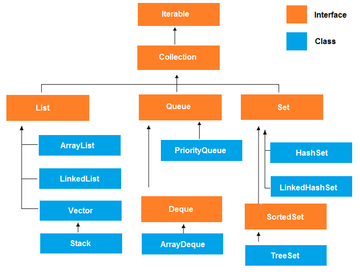

# Коллекции

## Вопросы:

1. Что такое коллекции (`Collection`) в Java? Какие основные интерфейсы коллекций вы знаете? Нарисуйте иерархию классов
   коллекций.
2. В чем разница между `List`, `Set` и `Map`?
3. Что такое `ArrayList`? В чем разница между `ArrayList` и `LinkedList`? Когда лучше использовать ArrayList, а когда
   LinkedList?
4. В чём разница между `Queue` и `Deque` и `Stack`?
5. Отличие двусвязного и односвязного списка?
6. В чём разница между `Iterable` и `Iterator`?
7. Что такое Iterator? В каких случаях нужно использовать iterator? И почему?
8. Что такое `HashMap`? Какие основные методы доступа и модификации данных в `HashMap`?
9. Может ли `null` быть ключом в `HashMap`?
10. Как работает `HashMap`?
11. Как работает метод put под капотом?
12. Что происходит при коллизии?
13. Что такое `HashSet`? Какая особенность у `HashSet` в отношении дубликатов и порядка элементов?
14. Какие коллекции из `Java Collections Framework` потокобезопасны (`thread-safe`) по умолчанию?
15. Что такое `ConcurrentHashMap`? В чем его отличие от `HashMap`?
16. Как можно сортировать элементы в коллекциях? Какой интерфейс следует использовать для сортировки?

## Ответы:

### Полезные материалы по коллекциям

1. [Сложность коллекций](https://www.bigocheatsheet.com)
2. [Визуализация коллекций](https://visualgo.net/en)

### 1. Что такое коллекции (`Collection`) в Java? Какие основные интерфейсы коллекций вы знаете? Нарисуйте иерархию классов коллекций.

Коллекции (`Collection`) - это набор классов которые используются для управления и хранения данных в Java. Каждый класс
использует определенную структуру данных для более эффективной работы. Однако нужно понимать, что каждая структура
имеет свои сильные и слабые стороны.

#### Основные виды коллекций

1. `List` - упорядоченная коллекция, в которой могут быть дубликаты.
   Реализации интерфейса `List` - `ArrayList`, `LinkedList`.
2. `Set` - коллекция основной особенностью которой является отсутствие дубликатов.
   Реализации интерфейса `Set` - `HashSet`, `TreeSet`.
3. `Queue` - коллекция, которая работает в стиле очереди, добавление элементов в одном конце и извлечение из другого.
   Реализации интерфейса `Queue` -  `LinkedList`, `PriorityQueue`.
4. `Map` - ассоциативная коллекция, те элементы связаны парами "ключ-значение", каждый ключ уникален и используется для
   получения значения.
   Реализации интерфейса `Map` - `HashMap`, `TreeMap`.



### 2. В чем разница между `List`, `Set` и `Map`?

Основная разница заключается в том, когда мы должны какую коллекцию использовать и какие в них есть особенности.

`List`:

- Упорядоченная коллекция и элементы хранятся в порядке их добавления.
- Элементы могут дублироваться.
- Можно получать доступ к элементам по индексам.

`Set`:

- Элементы не могут дублироваться.
- Не гарантирует порядок хранения элементов (в отличие от `List`).
- Метод `equals()` используется для определения уникальности элементов.

`Map`:

- Ассоциативная коллекция, хранящая пары "ключ-значение".
- Ключи уникальны, и каждому ключу соответствует одно значение.
- Позволяет быстро находить значение по ключу.

### 3. Что такое `ArrayList`? В чем разница между `ArrayList` и `LinkedList`? Когда лучше использовать `ArrayList`, а когда `LinkedList`?

`ArrayList` - это реализация интерфейса `List`, которая использует обычный массив для хранения данных.
`LinkedList` - это реализация интерфейса `List`, которая использует двусвязный список для хранения данных, те каждый
объект хранит ссылку на следующий элемент.

|                             | `ArrayList`                                                                                     | `LinkedList`                                                                                                                       |
|-----------------------------|-------------------------------------------------------------------------------------------------|------------------------------------------------------------------------------------------------------------------------------------|
| Внутреннее представление:   | основан на массиве, из-за этого быстрый доступ к элементам по индексу.                          | основан на двусвязном списке, где каждый элемент содержит ссылки на следующий элемент                                              |
| Вставка и удаление          | может быть медленным, так как при добавлении/удалении из середины нужно делать пересортировку   | быстрое добавление/удаление даже в середину                                                                                        | 
| Память и производительность | потребляет менбше памяти так как хранит только объекты                                          | требует больше памяти так как хранятся не только объекты но и ссылка на следующий элемент                                          |
| Поиск элемента              | быстро ищет по индексу, а так же быстрее итерируется, так как в памяти объекты лежат по очереди | перебор и поиск по индексу занимает обно и тоже время (больше чем `ArrayList`), поскольку идет простой перебор объектов по ссылкам |

`ArrayList` подходит когда у нас больше происходит чтений или получение по индексу, чем добавлений/удалений элементов.
`LinkedList` подходит когда у нас много добавлений/удалений особенно в середину списка.

### 4. В чём разница между `Queue` и `Deque` и `Stack`?

Основное отличие между `Queue` и `Deque` и `Stack` заключается в способе добавления и извлечения данных.

1. `Queue` (Очередь) - интерфейс, который позволяет работать с данными в стиле "очереди", добавление в конец очереди и
   извлечение
   из ее начала. Метод `offer()` добавляет элемент (в конец), а метод `pool()` извлекает элемент (из начала).
2. `Deque` (Двусторонняя очередь) - интерфейс, который расширяет `Queue` и позволяет добавлять и извлекать с обоих
   концов. Методы добавления: `offerFirst()`, `offerLast()` в начало и в конец соответственно, аналогично методы
   извлечения: `pollFirst()`, `pollLast()`.
3. `Stack` (Стек) - интерфейс реализующий структуру данных стек xD. Принцип работы похож на очередь, однако добавление и
   извлечение элементов происходит с одного конца. Аналог пирамиды, где каждый новым элемент кладется на предыдущий и
   убрать можно только самый верхний (последний добавленный). Метод добавления `push()`, извлечения `pop()`.

### 5. Отличие двусвязного и односвязного списка?

Отличие заключается в том, как элементы связаны друг с другом. В односвязном списке (Singly Linked List) элемент
содержит ссылку только на
следующий элемент, а то время как в двусвязном списке (Doubly Linked List)) элемент содержит ссылку как на следующий
элемент, как и на предыдущий.

Пример элемента в односвязном списке:

```java
public class Node<T> {
    private final T value; // Значение которое мы хотим хранить
    private final Node<T> next; // Ссылка на следующий элемент
}
```

Пример элемента в двусвязном списке:

```java
public class Node<T> {
    private final T value; // Значение которое мы хотим хранить
    private final Node<T> next; // Ссылка на следующий элемент
    private final Node<T> prev; // Ссылка на предыдущий элемент
}
```

### 6. В чём разница между `Iterable` и `Iterator`?

`Iterable` показывает, что объект можно перебрать, `Iterator` фактически выполняет процесс перебора коллекции.

`Iterable` - это интерфейс, который обозначает, что объект можно перебрать (проитерироваться). В интерфейсе определен
один метод `iterator()`, который возвращает объект типа `Iterator`. Стоит отметить, что `Iterable` - это родительский
интрефейс для всех коллекций.

`Iterator` - это интерфейс реализации которого используется для перебора коллекций. Определяет несколько
методов: `hasNext()` - проверяет есть ли следующий элемент, `next()` - возвращает следующий элемент, `remove()` -
опциональный метод (не всегда поддерживается) который позволяет удалить текущий элемент.

### 7. Что такое `Iterator`? В каких случаях нужно использовать `iterator`? И почему?

`Iterator` - это интерфейс реализации которого используется для перебора коллекций. Определяет несколько методов:

* `hasNext()` - проверяет есть ли следующий элемент
* `next()` - возвращает следующий элемент
* `remove()` - опциональный метод (не всегда поддерживается) который позволяет удалить текущий элемент

#### Когда нужно использовать `Iterator`?

* Последовательный перебор элементов в коллекции.
* Безопасное удаление элементов во время перебора.
* Снижение зависимости от конкретной реализации.

### 8. Что такое `HashMap`? Какие основные методы доступа и модификации данных в `HashMap`?

`HashMap` - это одна из реализаций `Map`, которая представляет собой ассоциативный массив ("ключ-значение"). Каждый
элемент храниться под каким-то ключом, что позволяет быстро находить значение по ключу.

#### Методы

1. `put(key, value)` - добавляет значение(`value`) по ключу (`key`), если ключ уже существует, значение будет
   перезаписано.
2. `get(key)` - получение значения по ключу, если ключа нет в мапе, то возвращается null.
3. `remove(key)` - удаление по указанному ключу.
4. `containsKey(key)` - проверка наличие ключа в мапе.
5. `containsValue(value)` - проверка наличия значения в мапе.
6. `size()` - возвращает количество пар ("ключ-значени") в мапе.
7. `isEmpty()` - проверяет есть ли что-то в мапе.

### 9. Может ли `null` быть ключом в `HashMap`?

Да, `null` может использоваться в качестве ключа для `HashMap`.

### 10. Как работает `HashMap`?

`HashMap` внутри себя содержит массив, каждый элемент массива мы будем называть корзина (bucket).
Каждый раз при добавлении элемента (`put(key, value)`) рассчитывается хэш для ключа (`key.hashCode()`) и на
основании этого хэша мы понимаем в какую корзину нужно добавлять значение (для этого хэш / размер массива). После
этого мы проверяем лежит ли что-то уже в этой корзине, если нет то добавляем. Если в корзине уже что-то лежит (это
называется коллизия), то в корзине образуется связанный список (linked list) и мы идем по этому списку и проверяем есть
ли элемент с таким же ключом или нет. Если элемента с таким же ключом нет, то мы просто добавим наше значение в конец
списка, если есть, то мы его перепишем.

Аналогичные действия мы делаем для поиска и удаления.
Если мы ищем по ключу, то рассчитываем хэш и в нужной корзине проверяем все элементы по ключу, если ничего не нашли
возвращаем `null`. При удалении мы определяем корзину по ключу и в ней пытаемся найти элемент с нужным ключом и удаляем
его.

Упрощенная реализация `HashMap`:

```java
public class HashMap {
    // Класс, который храниться как элемент корзины 
    class Node<K, V> {
        final K key; // ключ
        V value; // значение
        Node<K, V> next; // ссылка на следующий элемент
    }

    Node<K, V>[] buckets;

    public V put(K key, V value) {
        int hashCode = key.hashCode();
        int bucketIndex = hashCode / buckets.length - 1;

        // если в корзине ничего нет, то просто добавляем элемент
        if (buckets[bucketIndex] == null) {
            buckets[bucketIndex] = new Node<K, V>(hashCode, key, value, null);
        } else {
            Node<K, V> node = buckets[bucketIndex];

            while (node.next != null) {
                // ищем элемент с таким же ключом
                if (node.key == key) {
                    node.value = value; // заменяем значени по ключу
                    return value;
                }
                node = node.next;
            }

            // Если мы прошли по всем жлементам и не нашли с таким же ключом, то добавляем в конец
            Node<K, V> newNode = new Node<K, V>(hashCode, key, value, null);
            node.next = newNode; // не забываем добавить ссылку на новый элемент
        }
        return value;
    }

    public V get(K key) {
        int hashCode = key.hashCode();
        int bucketIndex = hashCode / buckets.length - 1;
        Node<K, V> node = buckets[bucketIndex];
        while (node != null) {
            // если нашлю элемент по ключу возвращаем его
            if (node.key == key) return node.value;
            node = node.next;
        }
        // если мы перебрали все элементы, но не нашли элемент с таким ключом, то возвращаем null
        return null;
    }

    public V remove(K key) {
        int hashCode = key.hashCode();
        int bucketIndex = hashCode / buckets.length - 1;
        Node<K, V> prev = null; // тут будем хранить элемент идущий до удаляемого
        Node<K, V> node = buckets[bucketIndex];
        while (node != null) {
            // если нашлю элемент по ключу
            if (node.key == key) {
                if (prev == null) {
                    // хотим удалить первый элемент
                    buckets[bucketIndex] = node.next;
                } else {
                    // хотим удалить не первый
                    // До удаления: 1 -> 2(prev) -> 3 (удаляем) -> null
                    // После: 1 -> 2(prev) -> null
                    prev.next = node.next;
                }
                return node.value;
            }
            prev = node; // сохраняем текущий элемент как предыдущий
            node = node.next; // переключаемся на следующий
        }
        // если мы перебрали все элементы, но не нашли элемент с таким ключом, то возвращаем null
        return null;
    }
}
```

Дополнительные материалы:

1. https://www.youtube.com/watch?v=c3RVW3KGIIE&ab_channel=Ranjithramachandran
2. https://habr.com/en/articles/128017/

### 11. Как работает метод put под капотом?

Каждый раз при добавлении элемента (`put(key, value)`) рассчитывается хэш для ключа (`key.hashCode()`) и на
основании этого хэша мы понимаем в какую корзину нужно добавлять значение (для этого хэш / размер массива). После
этого мы проверяем лежит ли что-то уже в этой корзине, если нет то добавляем. Если в корзине уже что-то лежит (это
называется коллизия), то в корзине образуется связанный список (linked list) и мы идем по этому списку и проверяем есть
ли элемент с таким же ключом или нет. Если элемента с таким же ключом нет, то мы просто добавим наше значение в конец
списка, если есть, то мы его перепишем.

Смотри пример выше с упрощенной реализацией `HashMap`

### 12. Что происходит при коллизии?

Коллизия - это ситуация при которой разным ключам соответствует один и тот же `hashCode` и вследствие этого оба объекта
будут храниться в одном и том же бакете (ячейке массива). Коллизия происходит из-за того, что хэшкод это число
типа `int` у которого есть ограничения. При коллизии в `HashMap` в одном бакете (ячейке массива) будет храниться не один
элемент, а связанный список из элементов с одинаковыми хэш-кодами.

В среднем случае коллизии не так страшны, поскольку в одном бакете храниться не слишком много элементов. Однако в худшем
случае, когда все элементы хранятся в одном бакете мы теряем все преимущества `HashMap` и получаем просто связанный
список (`LinkedList`).

### 13. Что такое `HashSet`? Какая особенность у `HashSet` в отношении дубликатов и порядка элементов?

`HashSet` - это одна из реализаций интерфейса `Set`, которая под капотом использует `HashMap` и в качестве значения
для `HashMap`использует дефолтный объект. Другими словами `HashSet` может быть заменен на `HashMap`, где ключами будут
значения которые вы хотите сохранить, а в качестве объекта будет константа.

#### Какая особенность у `HashSet` в отношении дубликатов и порядка элементов?

`HashSet` гарантирует уникальность элементов, при попытке добавить дубликат, новый элемент не будет добавлен.
`HashSet` не гарантирует никакой порядок, поскольку под капотом используется `HashMap` распределение элементов
происходит п хэшкоду из-за чего порядок добавления и извлечения могут отличаться (и в 99.(9)% будут разными xD).

### 14. Какие коллекции из `Java Collections Framework` потокобезопасны (`thread-safe`) по умолчанию?

Для начала давайте разберемся с термином "потокобезопасный". Потокобезопасность означает, что когда с коллекцией
работает не один, а сразу n потоков она будет работать точно так же как для одного потока и не будет возникать
"неожиданных" результатов.

Пример: В коллекции 100 элементов и я хочу найти 10 из них, то я могу искать по очереди 10 раз, но это может быть долго.
Тогда я могу запустить 10 потоков, которые будут в один и тот же момент времени искать каждый свое элемент.
Если результаты обоих подходов всегда будут одинаковы, то коллекция потокобезопасна.

#### Потокобезопасные коллекции по-умолчанию (из коробки):

1. `Vector` - это аналог `ArrayList`, но все методы помечены ключевым словом `synchronized`, что и обеспечивает
   потокобезопасность.
2. `Hashtable` - это аналог `HashMap`, но все методы помечены ключевым словом `synchronized`.

### 15. Что такое `ConcurrentHashMap`? В чем его отличие от `HashMap`?

`ConcurrentHashMap` - это реализация интерфейса `Map` из пакета `java.util.concurrent`, которая обеспечивает безопасную
работу в многопоточной среде. Основное отличие от `HashMap` заключается в том, что `HashMap` никак не обеспечивает
потокобезопасность, а в `ConcurrentHashMap` есть механизмы синхронизации.

Как происходит обеспечение потокобезопасности в разных реализациях `Map`:

1. `HashMap` вообще никак не обеспечивает потокобезопасность, поэтому могут возникать неожиданные результат если с ней
   работает сразу несколько потоков. Не рекомендуется использовать в многопоточной среде.
2. В `Hashtable` все методы помечены ключевым словом `synchronized`, поэтому в любой момент времени с этой коллекцией
   может работать только один поток, из-за этого производительность низкая в многопоточной среде.
3. `SynchronizedMap` - это просто обертка вокруг `Map`, в которой все методы помечены ключевым словом `synchronized`.
4. В `ConcurrentHashMap` все бакеты (ячейки массива) разделены на сегменты и доступ к каждому сегменту контролируется
   своим локом (объект для синхронизации). Другими словами если у вас 16 бакетов, которые разбиты на 4 сегмента, то в
   один момент времени могут работать по 1 потоку в каждом сегменте и они никак не будут конфликтовать. Из-за разбиения
   на сегменты мы улучшаем производительность коллекции, так как сразу несколько потоков могут безопасно работать с ней.

Картинка отлично иллюстрирующая отличия:

https://codepumpkin.com/hashtable-vs-synchronizedmap-vs-concurrenthashmap/

### 16. Как можно сортировать элементы в коллекциях? Какой интерфейс следует использовать для сортировки?

Для начала нужно понимать, что не все коллекции можно отсортировать.

1. Все реализации `List` могут быть отсортированы, для этого мы можем использовать метод `sort(Comparator<V> c)` в
   который передать `Comparator`.
2. `HashSet` не может быть отсортирован из-за того как он работает под капотом. `TreeSet` может быть использован, если
   нужно обеспечить уникальность элементов и их порядок. `TreeSet` использует естественный порядок или
   переданный `Comparator`.
3. `HashMap` не может быть отсортирован из-за того как он работает под капотом. `TreeMap` сортирует элементы при
   добавлении. `TreeMap` использует естественный порядок или переданный `Comparator`.

P.S. `Comparator` - это интерфейс, который позволяет задавать способ сравнения объектов.