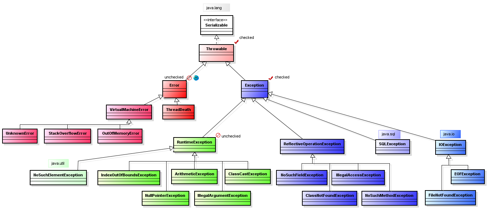

# Исключения

## Вопросы:

1. Что такое исключение (`Exception`) в Java? Какие проблемы они помогают обрабатывать?
2. Расскажи (нарисуй) про иерархию исключений?
3. Как создать свое исключение? Зачем создавать свои?
4. В чём разница между проверяемыми (`checked`) исключениями и непроверяемыми (`unchecked`)?
5. В чём разница с точки зрения синтаксиса и идеологическая при использовании?
6. Можно ли обработать непроверяемое исключение?
7. Можно ли в сигнатуре метода в `throws` указать непроверяемое исключение?
8. Нужно ли ловить `Error` исключения?
9. Как бросить исключение?
10. Можно ли бросить НЕ новое исключение?
11. Назовите знакомые вам исключения и когда они могут возникнуть.
12. Можно ли так написать `try { throw new Object(); }`
13. Может ли main выбрасывать исключения, что будет происходить?
14. Расскажи про информацию, которая находится внутри исключения? Как с ней работать?
15. Какую информацию можно получить из `StackTraceElement`?
16. Расскажи про конструкцию `try-catch-finally`?
17. Когда будет выполнен `finally`? Когда не будет выполнен?
18. Будет ли выполнен `finally` при `Error`?
19. Что будет если до перехода в `finally` был вызван `return`?
20. Какой `return` выполнится – если их два, один в `try`, другой в `finally`?
21. Что если в конструкции `try finally` вылетело исключение сначала в `try` а потом в `finally`? Какое исключение
    вылетит? Что будет с другим?
22. Что такое `try-with-resources`? Как работает эта конструкция?
23. Что такое ресурс в конструкции `try-with-resources`?
24. Что будет если при закрытии ресурса вылетит исключение в конструкции `try-with-resources`?
25. Что такое подавленные исключения?
26. Как достать подавленное исключение?

## Ответы:

### 1. Что такое исключение (`Exception`) в Java? Какие проблемы они помогают обрабатывать?

Исключение (`Exception`) - это объект, который представляет ошибку во время выполнения программы. Благодаря исключениям
мы как разработчики может контролировать поведение нашей программы если что-то пошло не так.

Во время работы программы могут возникать неожиданные проблемы такие как деление на ноль, обращение к не существующему
файлу или ошибка при соединении с сервером, все эти проблемы могут приводить к завершению программы. Однако благодаря
исключениям мы можем обработать ошибку и определить, что должно происходить если она случилась.

### 2. Расскажи (нарисуй) про иерархию исключений?

* Throwable (`checked`) - это базовый класс для всех исключений.
* Error (`unchecked`) - критические ошибки с которыми программа, в основном, ничего сделать не может.
  Распространенные: `OutOfMemoryError` или `StackOverflowError`.
* Exception (`checked`) - не критические ошибки, которые могут быть обработаны программой.
  Распространенные: `RuntimeException` или `IOException`.
* RuntimeException (`unchecked`) - подкатегория не проверяемых исключений (`Exception`).
  Распространенные: `NullPointerException`, `ArrayIndexOutOfBoundsException` и т.д.



[Источник изображения на сайте javastudy](https://javastudy.ru/interview/exceptions/)

### 3. Как создать свое исключение? Зачем создавать свои?

Для того чтобы создать свое исключение, нужно создать новый класс, который будет наследовать `Exception` (или другое
исключение).

```java
// Создаем пользовательское исключение
class CustomException extends Exception {
    public CustomException(String message) {
        super(message);
    }
}
```

Пользовательское исключение может помочь в отладке программы, поскольку может содержать дополнительную информацию, а
также возникать только в определнных случаях, о которых разработчики знают. К примеру у вас может быть свое исключение,
которое создается только при ошибке подключения к серверу базы данных. И когда вы увидете это исключение вы сразу будете
знать в чем проблема.

### 4. В чём разница между проверяемыми (`checked`) исключениями и непроверяемыми (`unchecked`) ?

Основное отличие заключается в том нужно ли проверять исключение или нет ( название говорит само за себя =) ).

* Непроверяемые (`unchecked`) исключения, которые не требуют обязательной обработки или объявления в сигнатуре метода.

* Проверяемые (`checked`) исключения должны быть указаны в сигнатуре метода. Если метод вызывает другой метод, который
  может вернуть проверяемое исключение (см пример ниже), то есть всего два варинта. Первый: мы должны обработать
  исключение с помощью try-catch или же второй вариант прокинуть ошибку выше и при этом указать ее в сигнатуре

```java
public class Example {

    // Вариант 1
    public void methodOne() throws FileNotFoundException {
        methodWithCheckedException();
    }

    public void methodTwo() {
        try {
            methodWithCheckedException();
        } catch (Exception e) {
            System.out.println("КАТАСТРОФА!! Мы не нашли такой файл");
        }
    }

    public void methodWithCheckedException() throws FileNotFoundException {
        throw new FileNotFoundException();
    }
}
```

### 5. В чём разница с точки зрения синтаксиса и идеологическая при использовании?

| Отличие   | Проверяемое исключение (`checked`)                                                                    | Непроверяемое исключение (`unchecked`)                                                     |
|-----------|-------------------------------------------------------------------------------------------------------|--------------------------------------------------------------------------------------------|
| Синтаксис | Должны быть либо обработаны с помощью `try-catch`, либо указаны в сигнатуре метода с помощью `throws` | Ничего делать не надо                                                                      |
| Назначени | Обычно это исключения которые могут произойти не по виде программиста и должны быть обработаны        | Обычно указывают на ошибку в коде, которую можно исправить (Пример `NullPointerException`) |

### 6. Можно ли обработать непроверяемое исключение?

Да, с помощью блока `try-catch` мы можем перехватить и обработать непроверяемое исключение. Однако нужно понимать, что
непроверяемое исключение обычно указывает на проблему в коде, которую допустил программист, и такие проблемы должны не
обрабатываться, а решаться исправлением кода.

### 7. Можно ли в сигнатуре метода в `throws` указать непроверяемое исключение?

Да, мы можем указать непроверяемое исключение в сигнатуре метода, однако это не наложит никаких дополнительных
ограничений. Мы можем не указывать это исключение в остальных методах, а также не должны его обрабатывать.

```java
public class UncheckedExceptionExample {
    public static void main(String[] args) {
        someMethod();
    }

    public static void someMethod() throws NullPointerException {
        int[] arr = null;
        System.out.println(arr.length); // Вызовет NullPointerException
    }
}
```

### 8. Нужно ли ловить `Error` исключения?

Нужно избегать ловить `Error`, поскольку этот тип исключений отвечает за критические ошибки в состоянии JVM или внешними
факторами с которыми программа не в состоянии справиться сама. Вы можете поймать это исключение, но в большинстве
случаев не сможете разрешить.

Примеры `Error`:

* `OutOfMemoryError` - программа исчерпала доступную память.
* `StackOverflowError` - стек вызовов переполнен из-за глубокой рекурсии.

### 9. Как бросить исключение?

Для того чтобы бросить исключение, нужно использовать ключевое слово `throw`.

```java
class Example {

    public void throwException() {
        throw new RuntimeException('Test exception!');
    }
}
```

### 10. Можно ли бросить НЕ новое исключение?

Да, если вы поймали исключение блоком `catch` и не знаете как его обработать, вы можете его пробросить выше используя
ключевое слово `throw`.

```java
class Example {

    // Метод где мы можем справиться с ошибкой
    public void methodOne() {
        try {
            methodTwo();
        } catch (Exception e) {
            System.out.println("Обработка RuntimeException исключения");
        }
    }

    // Метод где мы не знаем как обработать RuntimeException
    public void methodTwo() {
        try {
            throwException();
        } catch (Exception e) {
            if (e instanceof RuntimeException) {
                throw e;
            } else {
                System.out.println("Обработка исключения...");
            }
        }
    }

    public void throwException() {
        throw new RuntimeException('Test exception!');
    }
}
```

### 11. Назовите знакомые вам исключения и когда они могут возникнуть.

1. `NullPointerException` - возникает при обращении к объекту или вызове метода на переменной которая содержит
   значение `null`.
2. `ArrayIndexOutOfBoundsException` - возникает при обращении по индексу в массиве, которых больше размера массива.
3. `FileNotFoundException` - возникает, если мы пытаемся открыть файл которого нет или у нас нет доступа к нему.
4. `IOException` - возникает когда есть проблемы с чтением или записью данных.
5. `ArithmeticException` - возникает при арифметических ошибках (например, делении на ноль).
6. `ClassCastException` - возникает при неправильном приведении типов (например, при попытке привести объект к классу,
   которым он не является).
7. `OutOfMemoryError` - возникает, когда программа исчерпала доступную память.
8. `StackOverflowError` - возникает, когда стек вызовов переполняется из-за глубокой рекурсии.

### 12. Можно ли так написать `try { throw new Object(); }`

Нет так написать нельзя, мы получим ошибку компиляции, поскольку после `throw` должен идти объект типа `Throwable`.

### 13. Может ли main выбрасывать исключения, что будет происходить?

Да мы можем в main выбросить исключение. Если мы его перехватим и обработаем с помощью `try-catch`, то программа
продолжит работать дальше. Однако если мы его не перехватим, то программа завершиться с ошибкой.
Стоит отметить, что проверяемые (`checked`) исключения должны быть объявлены в сигнатуре метода main

```java
public class Example {
    // не забываем объявить проверяемое исключение в сигнатуре метода
    public static void main(String[] args) throws IOException {
        throw new IOException("Исключение в методе main");
    }
}
```

### 14. Расскажи про информацию, которая находится внутри исключения? Как с ней работать?

Исключения содержат в себе информацию о том, какая ошибка и где произошла, а также могут содержать дополнительные
сведения о том, какие условия привели к ошибке.

* Сообщение об ошибке (message) - текстовое сообщение с объяснением ошибки.
* Стек вызовов (stack trace) - упорядоченный список методов которые были вызваны до момента когда произошла ошибка

### 15. Какую информацию можно получить из `StackTraceElement`?

Объект `StackTraceElement` представляет элемент в стеке вызовов (stack trace). Из него можно получить:

1. Имя файла в котором лежит вызываемый метод. Метод: `getFileName()`.
2. Имя класса где был вызван метод. Метод: `getClassName()`.
3. Имя вызываемого метода. Метод: `getMethodName()`.
4. Номер строки на которой находится вызываемый метод. Метод: `getLineNumber()`.

### 16. Расскажи про конструкцию `try-catch-finally`?

`try-catch-finally` - это конструкция, которая используется в Java для обработки исключений.
В блоке `try` мы можем выполнять код, который потенциально может выбросить исключение.
В блоке `catch` мы можем указать какие исключения мы хотим перехватывать и как их нужно обработать.
В блоке `finally` мы можем написать код, который будет выполнен не зависимо от того было ли исключение или нет.

```java
public class Example {
    public static void main(String[] args) {
        try {
            int result = divide(10, 0);
            System.out.println("Результат: " + result);
        } catch (ArithmeticException e) {
            System.out.println("Произошла ошибка: " + e.getMessage());
        } finally {
            System.out.println("Блок finally выполнен всегда");
        }
    }

    public static int divide(int a, int b) {
        return a / b;
    }
}
```

### 17. Когда будет выполнен `finally`? Когда не будет выполнен?

Блок `finally` будет выполнен после блока `try` если исключения не было или же после блока `catch` если оно произошло.
Стоит отметить несколько причин по которым блок `finally` может не выполняться.

1. Если был вызван метод для завершения программы: `System.exit()`.
2. Если в блоке `try` или `catch` бесконечный цикл, который никогда не завершиться.

### 18. Будет ли выполнен `finally` при `Error`?

Да, блок `finally` будет выполнен даже при возникновении `Error`

```java
public class FinallyWithErrorExample {
    public static void main(String[] args) {
        try {
            throw new StackOverflowError("Пример ошибки");
        } finally {
            System.out.println("Блок finally выполнен, даже при Error");
        }
    }
}
```

### 19. Что будет если до перехода в `finally` был вызван `return`?

Если в блоке `try` или `catch` был вызван `return`, то блок `finally` будет вызван в любом случае.

### 20. Какой `return` выполнится – если их два, один в `try`, другой в `finally`?

Результат блока `finally` будет всегда "главнее" чем результат работы блока `try` или `catch`. Давайте рассмотрим на
примере.

```java
class Scratch {
    public static void main(String[] args) {
        System.out.println(testMethod()); // Выведет: 11
    }

    public static int testMethod() {
        try {
            return 10;
        } finally {
            System.out.println("Блок finally выполнен");
            return 11;
        }
    }
}
```

### 21. Что если в конструкции `try finally` вылетело исключение сначала в `try` а потом в `finally`? Какое исключение вылетит? Что будет с другим?

Как мы обсуждали в прошлом вопросе, результат `finally` всегда "главнее" результат блоков `try` или `catch`. Абсолютно
такая же логика и с исключениями. Если сначала было исключение в блоке `try` или `catch`, а потом в блоке `finally`, как
результата мы увидим исключение из `finally`, а исключения из блока `try` или `catch` будут "подавлены". Поскольку
считается, что ошибка в `finally` критичнее чем в `try` или `catch`.

```java
class Example {
    public static void main(String[] args) {
        try {
            testMethod();
        } catch (Exception e) {
            System.out.println(e.getMessage());
        }
    }

    public static int testMethod() {
        try {
            throw new RuntimeException("Exception from try block!");
        } finally {
            throw new RuntimeException("Exception from finally block!");
        }
    }
}
```

### 22. Что такое `try-with-resources`? Как работает эта конструкция?

`try-with-resources` - это конструкция, использующаяся когда нам нужно поработать с ресурсами, которые должны быть
закрыты в конце. Благодаря этой конструкции мы можем не беспокоиться о том, что мы не закроем вручную какие-то ресурсы,
поскольку они закроются автоматически.
Стоит отметить, что ресурсы должны реализовывать интерфейс `java.lang.AutoCloseable`, в котором декларируется всего один
метод `close()`. Этот метод и будет вызван для закрытия ресурсов.

Синтаксис

```
try (ресурс_1_инициализация; ресурс_2_инициализация; ...) {
    // Код, использующий ресурсы
} catch (исключение) {
    // Обработка исключения
}
```

Пример:

```java
class Example {
    public class TryWithResourcesExample {

        public static void main(String[] args) {
            try (MyResource resource = new MyResource()) {
                resource.doSomething();
            } catch (Exception e) {
                System.out.println("Произошла ошибка: " + e.getMessage());
            }
        }
    }

    static class MyResource implements AutoCloseable {
        public void doSomething() throws Exception {
            System.out.println("Выполняем действия с ресурсом");
            throw new Exception("Пример ошибки");
        }

        @Override
        public void close() throws Exception {
            System.out.println("Ресурс закрыт");
        }
    }
}
```

### 23. Что такое ресурс в конструкции `try-with-resources`?

Ресурс - это объект, который реализует интерфейс `java.lang.AutoCloseable` или `java.io.Closeable`.
Ресурс - это объект с которым мы хотим поработать и после корректно его закрыть, чтобы не допустить утечек памяти и
обеспечить правильное освобождение ресурсов.

### 24. Что будет если при закрытии ресурса вылетит исключение в конструкции `try-with-resources`?

Если блок `try` завершается корректно, то мы просто увидим исключение полученное при закрытии ресурса. Но если
блок `try` упал с ошибкой и произошла ошибка при закрытии ресурсов, то мы увидим ошибку из блока `try`, а ошибка при
закрытии ресурсов будет "подавлена". Это сделано для того, чтобы мы не упустили "важную" ошибку из блока `try`.
Подавленные ошибки можно получить с помощью метода `getSuppressed()`.

Пример с корректным завершением блока `try`:

```java
class Example {
    public static void main(String[] args) {
        try (MyResource resource = new MyResource()) {
            resource.doSomething();
        } catch (Exception e) {
            System.out.println("Произошла ошибка: " + e.getMessage()); //

            Throwable[] suppressed = e.getSuppressed();
            for (Throwable t : suppressed) {
                System.out.println("Подавлено: " + t);
            }
        }
    }

    static class MyResource implements AutoCloseable {
        public void doSomething() throws Exception {
            System.out.println("Выполняем действия с ресурсом");
        }

        @Override
        public void close() throws Exception {
            System.out.println("Закрываем ресурс");
            throw new Exception("Ошибка при закрытии ресурса");
        }
    }
}
```

Вывод в консоль:

```
Выполняем действия с ресурсом
Закрываем ресурс
Произошла ошибка: Ошибка при закрытии ресурса
```

Пример когда `try` упал с ошибкой:

```java
class Example {

    public static void main(String[] args) {
        try (MyResource resource = new MyResource()) {
            resource.doSomething();
        } catch (Exception e) {
            System.out.println("Произошла ошибка: " + e.getMessage());
            Throwable[] suppressed = e.getSuppressed();
            for (Throwable t : suppressed) {
                System.out.println("Подавлено: " + t);
            }
        }
    }

    static class MyResource implements AutoCloseable {
        public void doSomething() throws Exception {
            System.out.println("Выполняем действия с ресурсом");
            throw new Exception("Ошибка внутри ресурса");
        }

        @Override
        public void close() throws Exception {
            System.out.println("Закрываем ресурс");
            throw new Exception("Ошибка при закрытии ресурса");
        }
    }
}
```

Вывод в консоль:

```
Выполняем действия с ресурсом
Закрываем ресурс
Произошла ошибка: Ошибка внутри ресурса
Подавлено: java.lang.Exception: Ошибка при закрытии ресурса
```

### 25. Что такое подавленные исключения?

Как мы уже обсудили выше, "подавленным" называется исключение которое произошло при закрытии ресурсов, когда мы
использовали конструкцию `try-with-resources`. Если блок `try` выбрасывает исключение и после этого мы получаем
исключение при закрытии ресурсов, то мы увидим исключение из блока `try`. Исключение, которое произошло при закрытии
ресурсов, будет "подавлено".

См последний пример выше.

### 26. Как достать подавленное исключение?

Для того чтобы достать "подавленное" исключение, мы должны использовать метода `getSuppressed()`. Этот метод возвращает
массив исключений, которые были подавленны. Мы получаем массив, поскольку в конструкции `try-with-resources` мы можем
начать работу сразу с несколькими ресурсами.