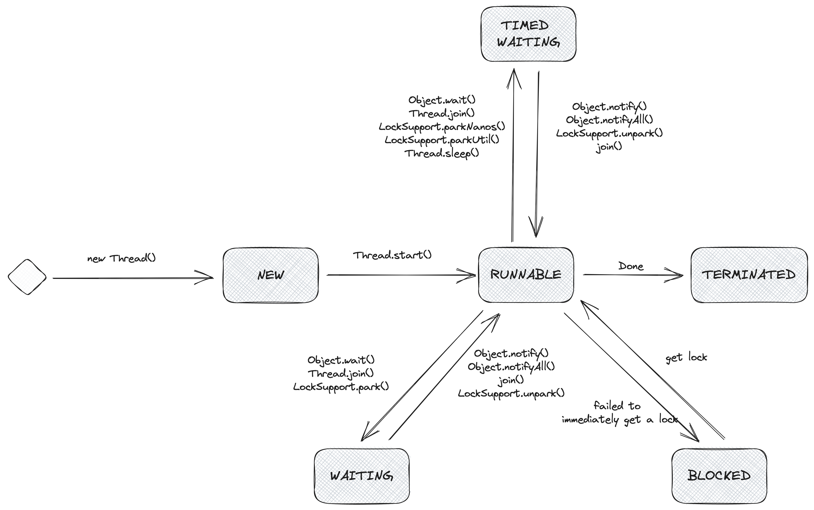

# Оглавление

## Что такое потоки и процессы?

### Что такое процесс?

Процесс в компьютерной системе представляет собой выполнение программы и является основной единицей для запуска
программ. В Java, когда мы запускаем программу, на самом деле запускается процесс Java Virtual Machine (JVM), а основной
поток, в котором выполняется основная функция программы, является одним из потоков в этом процессе, известным как
основной поток.
Представим это на примере. При запуске программы в операционной системе, например, в Windows, создается соответствующий
процесс, который может быть наблюдаем в диспетчере задач. Этот процесс представляет собой выполнение программы
(например, запуск .exe-файла).
В случае Java-программы, процесс **JVM** (*Java Virtual Machine*) запускается, когда мы запускаем программу. Внутри
процесса JVM создается основной поток, который выполняет основную функцию программы. Он может быть рассмотрен как
основная нить исполнения внутри процесса JVM. Основной поток является точкой входа для выполнения программы и может
порождать дополнительные потоки исполнения при необходимости.
Таким образом, процесс в Java представляет собой выполнение программы, а основной поток является потоком исполнения
внутри этого процесса, который выполняет основную функцию программы.

### Что такое поток?

Потоки являются более мелкими единицами выполнения по сравнению с процессами. Процесс может порождать несколько потоков
во время своего выполнения. В отличие от процессов, несколько потоков одного процесса совместно используют ресурсы кучи
и области методов процесса. Однако каждый поток имеет свой собственный программный счетчик, стек виртуальной машины и
локальный стек методов.
При переключении между потоками нагрузка на систему намного меньше, чем при переключении между процессами. Поэтому
потоки также называются легковесными процессами. Программы на Java, по своей сути, являются многопоточными программами,
и мы можем использовать *Java Management Extensions* (**JMX**), чтобы увидеть, какие потоки присутствуют в обычной
Java-программе.
Вот пример кода, который позволяет нам получить информацию о потоках в Java:

```java
import java.lang.management.ManagementFactory;
import java.lang.management.ThreadInfo;
import java.lang.management.ThreadMXBean;

public class ThreadExample {
    public static void main(String[] args) {
        // Получаем экземпляр ThreadMXBean
        ThreadMXBean threadMXBean = ManagementFactory.getThreadMXBean();

        // Получаем информацию о потоках
        ThreadInfo[] threadInfos = threadMXBean.dumpAllThreads(false, false);

        // Выводим информацию о каждом потоке
        for (ThreadInfo threadInfo : threadInfos) {
            System.out.println("Thread ID: " + threadInfo.getThreadId());
            System.out.println("Thread Name: " + threadInfo.getThreadName());
            System.out.println("Thread State: " + threadInfo.getThreadState());
            System.out.println("===========================");
        }
    }
}
```

В этом примере мы используем `ThreadMXBean`, который предоставляет методы для управления и мониторинга потоков в Java.
Метод `dumpAllThreads(false, false)` возвращает информацию о всех потоках в системе. Затем мы выводим информацию о
каждом потоке, такую как его идентификатор (**ID**), имя и состояние.

Этот пример поможет нам лучше понять, какие потоки существуют в обычной Java-программе и как можно использовать Java
Management Extensions для их анализа и мониторинга.

---

### Разница между синхронными и асинхронными вызовами

1. Синхронная обработка: после выполнения вызова происходит ожидание результата, и вызывающая сторона не продолжает
   выполнение до получения результата.
2. Асинхронная обработка: после выполнения вызова происходит немедленное возвращение, и
   вызывающая сторона может продолжить свою работу без ожидания результата возврата.

### Зачем использовать многопоточность?

Поток можно рассматривать как легковесный процесс, являющийся наименьшей единицей выполнения программы. Переключение и
планирование между потоками имеют гораздо меньшие накладные расходы по сравнению с процессами. С развитием многоядерных
процессоров, несколько потоков могут выполняться одновременно, что позволяет снизить накладные расходы на переключение
контекста потока. С точки зрения современных требований Интернета: Современные системы требуют миллионы или даже десятки
миллионов параллельных операций, и многопоточное параллельное программирование является фундаментом для разработки
высокопараллельных систем. Эффективное использование механизмов многопоточности может значительно повысить общий уровень
параллелизма, возможности и производительность системы.

### Жизненный цикл потока

Поток в Java может находиться в одном из следующих 6 различных состояний:

1. NEW - начальное состояние, когда поток создан, но метод `start()` ещё не вызван.
2. RUNNABLE - состояние выполнения, когда поток готов к выполнению и ожидает запуска.
3. BLOCKED - состояние блокировки, когда поток ожидает разблокировки ресурса или монитора.
4. WAITING - состояние ожидания, когда поток ожидает, пока другой поток выполнит определенные действия, такие как уведомление или прерывание.
5. TIME_WAITING - состояние ожидания с тайм-аутом, когда поток ожидает определенное время, после чего возвращается в RUNNABLE состояние.
6. TERMINATED - состояние завершения, когда выполнение потока завершено.

